# Lab : Introduction to neural prediction: forward propagation

#### Pre-reqs:
- Google Chrome (Recommended)

#### Lab Environment
Notebooks are ready to run. All packages have been installed. There is no requirement for any setup.

**Note:** Elev8ed Notebooks (powered by Jupyter) will be accessible at the port given to you by your instructor. Password for jupyterLab : `1234`

All Notebooks are present in `work/Grokking-Deep-Learning` folder. To copy and paste: use **Control-C** and to paste inside of a terminal, use **Control-V**

You can access jupyter lab at `<host-ip>:<port>/lab/workspaces/lab1_Forward_Propagation`

In this lab
- A simple network making a prediction
- What is a neural network, and what does it do?
- Making a prediction with multiple inputs
- Making a prediction with multiple outputs
- Making a prediction with multiple inputs
and outputs
- Predicting on predictions

I try not to get involved in the business of prediction.
It’s a uick way to look like an idiot.
—Warren Ellis comic-book writer,
novelist, and screenwriter

## Step 1: Predict

**This lab is about prediction.**

In the previous lab, you learned about the paradigm predict, compare, learn. In this
chapter, we’ll dive deep into the first step: predict. You may remember that the predict step
looks a lot like this:

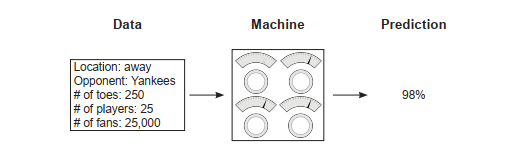

In this lab, you’ll learn more about what these three different parts of a neural network
prediction look like under the hood. Let’s start with the first one: the data. In your first
neural network, you’re going to predict one datapoint at a time, like so:

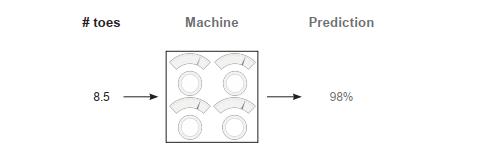

Later, you’ll find that the number of datapoints you process at a time has a significant
impact on what a network looks like. You might be wondering, "How do I choose how
many datapoints to propagate at a time?" The answer is based on whether you think the
neural network can be accurate with the data you give it.

For example, if I’m trying to predict whether there’s a cat in a photo, I definitely need to
show my network all the pixels of an image at once. Why? Well, if I sent you only one
pixel of an image, could you classify whether the image contained a cat? Me neither!
(That’s a general rule of thumb, by the way: always present enough information to the
network, where "enough information" is defined loosely as how much a human might
need to make the same prediction.)

Let’s skip over the network for now. As it turns out, you can create a network only after
you understand the shape of the input and output datasets (for now, shape means "number
of columns" or "number of datapoints you’re processing at once"). Let’s stick with a single
prediction of the likelihood that the baseball team will win:

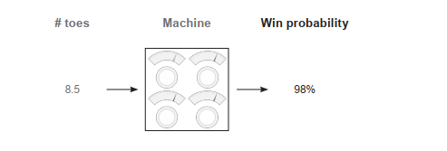

Now that you know you want to take one input datapoint and output one prediction, you
can create a neural network. Because you have only one input datapoint and one output
datapoint, you’re going to build a network with a single knob mapping from the input point
to the output. (Abstractly, these "knobs" are actually called weights, and I’ll refer to them
as such from here on out.) So, without further ado, here’s your first neural network, with a
single weight mapping from the input "# toes" to the output "win?":

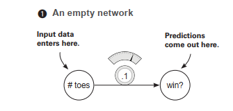

As you can see, with one weight, this network takes in one datapoint at a time (average
number of toes per player on the baseball team) and outputs a single prediction (whether it
thinks the team will win).

<h4><span style="color:red;">A simple neural network making a prediction </span></h4>

**Let’s start with the simplest neural network possible.**

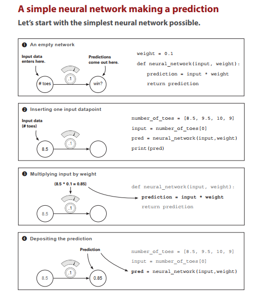

## What is a neural network?

**Here is your first neural network.**

To start a neural network, open a Jupyter notebook and run this code:

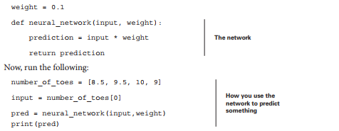

You just made your first neural network and used it to predict! Congratulations! The last line
prints the prediction (pred). It should be 0.85. So what is a neural network? For now, it’s one or
more weights that you can multiply by the input data to make a prediction.

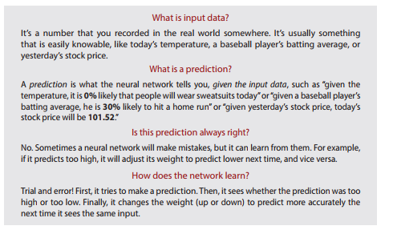

## What does this neural network do?

**It multiplies the input by a weight. It "scales" the input by a certain amount.**

In the previous section, you made your first prediction with a neural network. A neural network,
in its simplest form, uses the power of multiplication. It takes an input datapoint (in this case,
8.5) and multiplies it by the weight. If the weight is 2, then the neural network will double the
input. If the weight is 0.01, then the network will divide the input by 100. As you can see, some
weight values make the input bigger, and other values make it smaller.

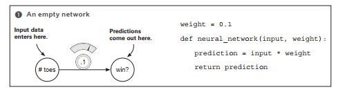

The interface for a neural network is simple. It accepts an input variable as information and a
weight variable as knowledge and outputs a prediction. Every neural network you’ll ever see
works this way. It uses the knowledge in the weights to interpret the information in the input
data. Later neural networks will accept larger, more complicated input and weight values, but
this same underlying premise will always ring true.

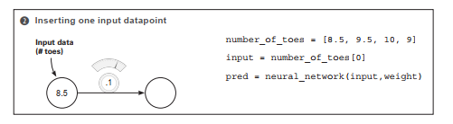

In this case, the information is the average number of toes on a baseball team before a game.
Notice several things. First, the neural network does not have access to any information
except one instance. If, after this prediction, you were to feed in number_of_toes[1], the
network wouldn’t remember the prediction it made in the last timestep. A neural network
knows only what you feed it as input. It forgets everything else. Later, you’ll learn how to
give a neural network a "short-term memory" by feeding in multiple inputs at once.

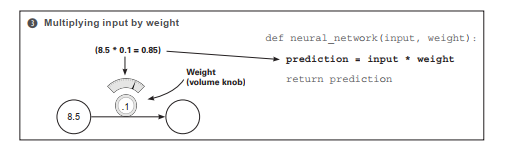

Another way to think about a neural network’s weight value is as a measure of sensitivity
between the input of the network and its prediction. If the weight is very high, then even the
tiniest input can create a really large prediction! If the weight is very small, then even large
inputs will make small predictions. This sensitivity is akin to volume. "Turning up the weight"
amplifies the prediction relative to the input: weight is a volume knob!

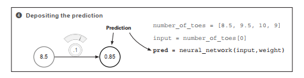

In this case, what the neural network is really doing is applying a volume knob to the
number_of_toes variable. In theory, this volume knob can tell you the likelihood that the team
will win, based on the average number of toes per player on the team. This may or may not work.
Truthfully, if the team members had an average of 0 toes, they would probably play terribly. But
baseball is much more complex than this. In the next section, you’ll present multiple pieces of
information at the same time so the neural network can make more-informed decisions.

Note that neural networks don’t predict just positive numbers—they can also predict negative
numbers and even take negative numbers as input. Perhaps you want to predict the probability
that people will wear coats today. If the temperature is –10 degrees Celsius, then a negative
weight will predict a high probability that people will wear their coats.


## Making a prediction with multiple inputs

**Neural networks can combine intelligence from multiple datapoints.**

The previous neural network was able to take one datapoint as input and make one prediction
based on that datapoint. Perhaps you’ve been wondering, "Is the average number of toes really
a good predictor, all by itself?" If so, you’re onto something. What if you could give the network
more information (at one time) than just the average number of toes per player? In that case,
the network should, in theory, be able to make more-accurate predictions. Well, as it turns out, a
network can accept multiple input datapoints at a time. Take a look at the next prediction:

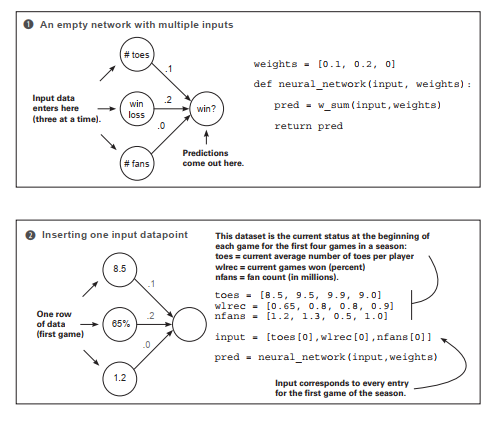

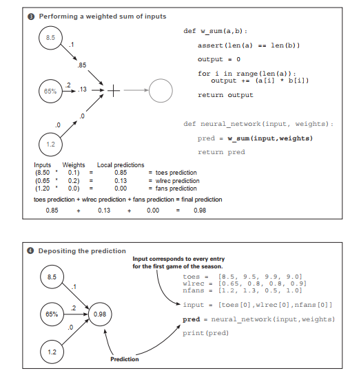


<h4><span style="color:red;">Multiple inputs: What does this neural network do?</span></h4>

**It multiplies three inputs by three knob weights and sums them.**

**This is a weighted sum.** 

At the end of the previous section, you came to realize the limiting factor of your simple
neural network: it was only a volume knob on one datapoint. In the example, that datapoint
was a baseball team’s average number of toes per player. You learned that in order to make
accurate predictions, you need to build neural networks that can combine multiple inputs at
the same time. Fortunately, neural networks are perfectly capable of doing so.

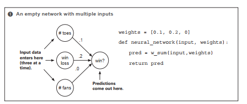

This new neural network can accept multiple inputs at a time per prediction. This allows the
network to combine various forms of information to make better-informed decisions. But
the fundamental mechanism for using weights hasn’t changed. You still take each input and
run it through its own volume knob. In other words, you multiply each input by its own
weight.

The new property here is that, because you have multiple inputs, you have to sum their
respective predictions. Thus, you multiply each input by its respective weight and then sum
all the local predictions together. This is called a weighted sum of the input, or a weighted sum
for short. Some also refer to the weighted sum as a dot product, as you’ll see.

<h4><span style="color:red;">A relevant reminder</span></h4>
 

The interface for the neural network is simple: it accepts an input variable as information and
a weights variable as knowledge, and it outputs a prediction.

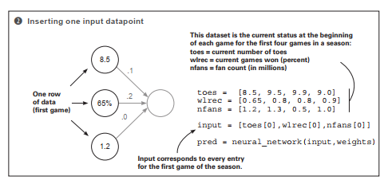

This new need to process multiple inputs at a time justifies the use of a new tool. It’s called a vector,
and if you’ve been following along in your Jupyter notebook, you’ve already been using it. A vector
is nothing other than a list of numbers. In the example, input is a vector and weights is a vector.
Can you spot any more vectors in the previous code? (There are three more.)

As it turns out, vectors are incredibly useful whenever you want to perform operations
involving groups of numbers. In this case, you’re performing a weighted sum between two
vectors (a dot product). You’re taking two vectors of equal length (input and weights),
multiplying each number based on its position (the first position in input is multiplied by
the first position in weights, and so on), and then summing the resulting output.

Anytime you perform a mathematical operation between two vectors of equal length where
you pair up values according to their position in the vector (again: position 0 with 0, 1 with 1,
and so on), it’s called an elementwise operation. Thus elementwise addition sums two vectors,
and elementwise multiplication multiplies two vectors.

<h4><span style="color:red;">Challenge: Vector math</span></h4>

Being able to manipulate vectors is a cornerstone technique for deep learning. See if you can
write functions that perform the following operations:

- def elementwise_multiplication(vec_a, vec_b)
- def elementwise_addition(vec_a, vec_b)
- def vector_sum(vec_a)
- def vector_average(vec_a)

Then, see if you can use two of these methods to perform a dot product!

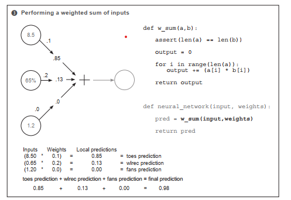

The intuition behind how and why a dot product (weighted sum) works is easily one of the most
important parts of truly understanding how neural networks make predictions. Loosely stated, a
dot product gives you a notion of similarity between two vectors. Consider these examples:

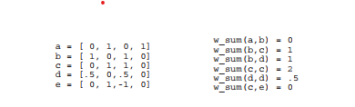

The highest weighted sum (w_sum(c,c)) is between vectors that are exactly identical. In
contrast, because a and b have no overlapping weight, their dot product is zero. Perhaps
the most interesting weighted sum is between c and e, because e has a negative weight.
This negative weight canceled out the positive similarity between them. But a dot product
between e and itself would yield the number 2, despite the negative weight (double
negative turns positive). Let’s become familiar with the various properties of the dot
product operation.

Sometimes you can equate the properties of the dot product to a logical AND. Consider a and b:

```
a = [ 0, 1, 0, 1]
b = [ 1, 0, 1, 0]
```

If you ask whether both a[0] AND b[0] have value, the answer is no. If you ask whether both
a[1] AND b[1] have value, the answer is again no. Because this is always true for all four
values, the final score equals 0. Each value fails the logical AND.

```
b = [ 1, 0, 1, 0]
c = [ 0, 1, 1, 0]
```

b and c, however, have one column that shares value. It passes the logical AND because b[2]
and c[2] have weight. This column (and only this column) causes the score to rise to 1.

```
c = [ 0, 1, 1, 0]
d = [.5, 0,.5, 0]
```

Fortunately, neural networks are also able to model partial ANDing. In this case, c and d share
the same column as b and c, but because d has only 0.5 weight there, the final score is only 0.5.
We exploit this property when modeling probabilities in neural networks.

```
d = [.5, 0,.5, 0]
e = [-1, 1, 0, 0]
```

In this analogy, negative weights tend to imply a logical NOT operator, given that any positive
weight paired with a negative weight will cause the score to go down. Furthermore, if both
vectors have negative weights (such as w_sum(e,e)), then the neural network will perform
a double negative and add weight instead. Additionally, some might say it’s an OR after the
AND, because if any of the rows show weight, the score is affected. Thus, for w_sum(a,b), if
(a[0] AND b[0]) OR (a[1] AND b[1]), and so on, then w_sum(a,b) returns a positive score.
Furthermore, if one value is negative, then that column gets a NOT.

Amusingly, this gives us a kind of crude language for reading weights. Let’s read a few
examples, shall we? These assume you’re performing w_sum(input,weights) and the "then"
to these if statements is an abstract "then give high score":

```
weights = [ 1, 0, 1] => if input[0] OR input[2]

weights = [ 0, 0, 1] => if input[2]

weights = [ 1, 0, -1] => if input[0] OR NOT input[2]

weights = [ -1, 0, -1] => if NOT input[0] OR NOT input[2]

weights = [ 0.5, 0, 1] => if BIG input[0] or input[2]
```

Notice in the last row that weight[0] = 0.5 means the corresponding input[0] would
have to be larger to compensate for the smaller weighting. And as I mentioned, this is a very

crude approximate language. But I find it immensely useful when trying to picture in my
head what’s going on under the hood. This will help you significantly in the future, especially
when putting networks together in increasingly complex ways.
Given these intuitions, what does this mean when a neural network makes a prediction?
Roughly speaking, it means the network gives a high score of the inputs based on how
similar they are to the weights. Notice in the following example that nfans is completely
ignored in the prediction because the weight associated with it is 0. The most sensitive
predictor is wlrec because its weight is 0.2. But the dominant force in the high score is
the number of toes (ntoes), not because the weight is the highest, but because the input
combined with the weight is by far the highest.

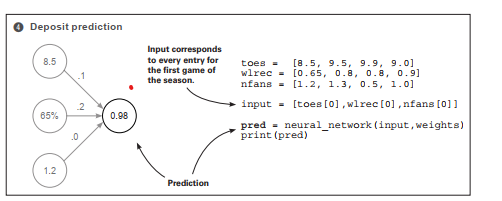

Here are a few more points to note for further reference. You can’t shuffle weights: they have
specific positions they need to be in. Furthermore, both the value of the weight and the value of
the input determine the overall impact on the final score. Finally, a negative weight will cause
some inputs to reduce the final prediction (and vice versa).

## Multiple inputs: Complete runnable code

The code snippets from this example come together in the following code, which creates and
executes a neural network. For clarity, I’ve written everything out using basic properties of
Python (lists and numbers). But a better way exists that we’ll begin using in the future.

**Previous code**

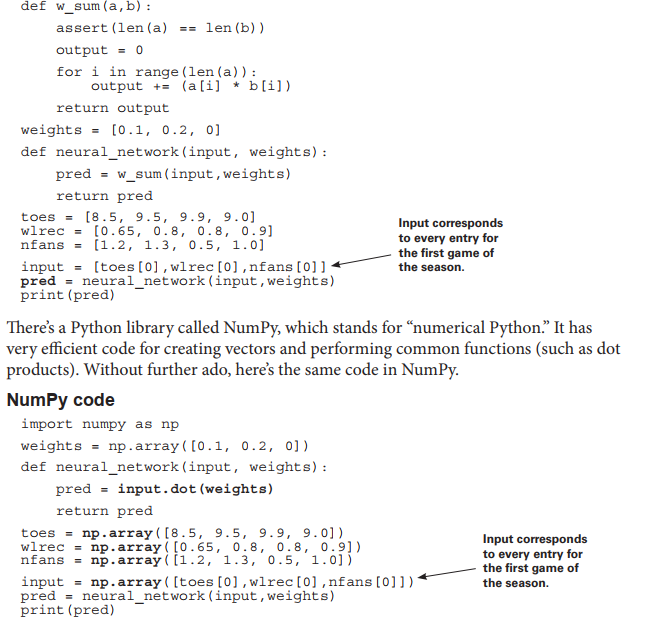

Both networks should print out 0.98. Notice that in the NumPy code, you don’t have to
create a w_sum function. Instead, NumPy has a dot function (short for "dot product") you
can call. Many functions you’ll use in the future have NumPy parallels.


## Making a prediction with multiple outputs

## Neural networks can also make multiple predictions using only a single input.##

Perhaps a simpler augmentation than multiple inputs is multiple outputs. Prediction occurs
the same as if there were three disconnected single-weight neural networks.

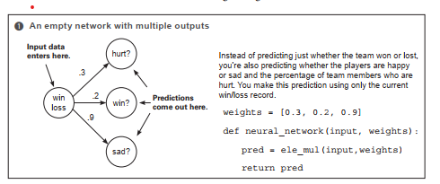

The most important comment in this setting is to notice that the three predictions are
completely separate. Unlike neural networks with multiple inputs and a single output, where
the prediction is undeniably connected, this network truly behaves as three independent
components, each receiving the same input data. This makes the network simple to implement.

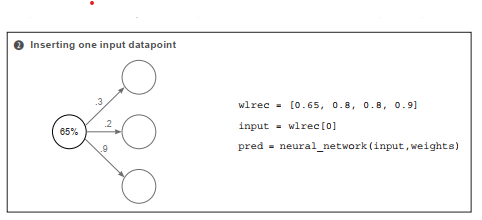

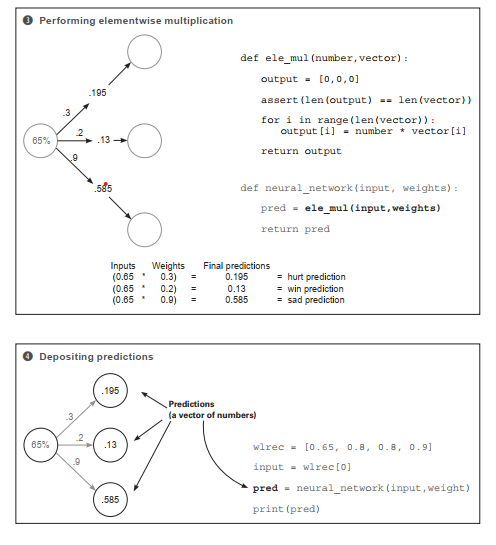

## Predicting with multiple inputs and outputs
**Neural networks can predict multiple outputs given multiple inputs.**

Finally, the way you build a network with multiple inputs or outputs can be combined to build
a network that has both multiple inputs and multiple outputs. As before, a weight connects each
input node to each output node, and prediction occurs in the usual way.

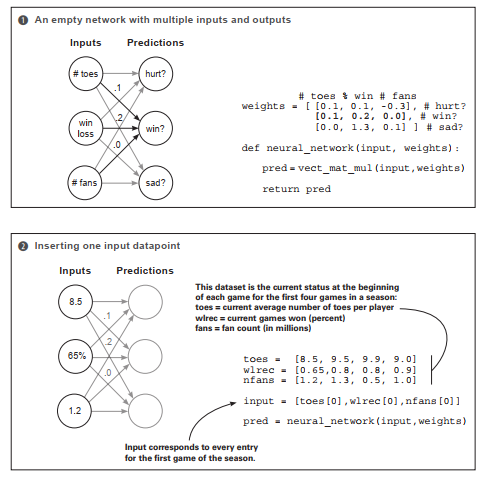

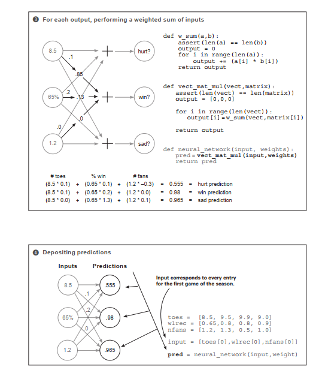

## Multiple inputs and outputs: How does it work?

**It performs three independent weighted sums of the input to make three predictions.**

You can take two perspectives on this architecture: think of it as either three weights coming
out of each input node, or three weights going into each output node. For now, I find the
latter to be much more beneficial. Think about this neural network as three independent dot
products: three independent weighted sums of the input. Each output node takes its own
weighted sum of the input and makes a prediction.

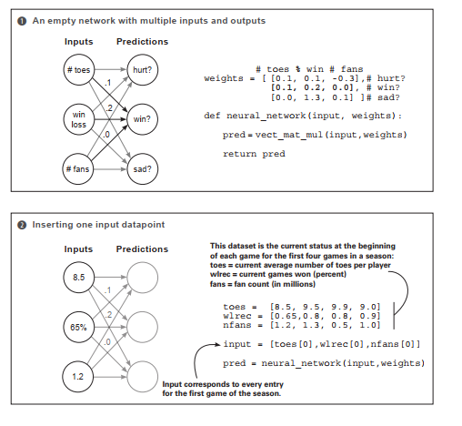

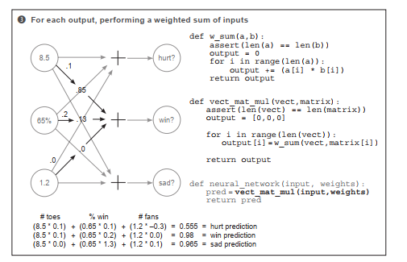

As mentioned earlier, we’re choosing to think about this network as a series of weighted
sums. Thus, the previous code creates a new function called vect_ mat_mul. This function
iterates through each row of weights (each row is a vector) and makes a prediction using
the w_sum function. It’s literally performing three consecutive weighted sums and then
storing their predictions in a vector called output. A lot more weights are flying around in
this one, but it isn’t that much more advanced than other networks you’ve seen.

I want to use this list of vectors and series of weighted sums logic to introduce two new
concepts. See the weights variable in step 1? It’s a list of vectors. A list of vectors is called a
matrix. It’s as simple as it sounds. Commonly used functions use matrices. One of these is
called vector-matrix multiplication. The series of weighted sums is exactly that: you take a
vector and perform a dot product with every row in a matrix.* As you’ll find out in the next
section, NumPy has special functions to help.

## Predicting on predictions

**Neural networks can be stacked!**

As the following figures make clear, you can also take the output of one network and feed it
as input to another network. This results in two consecutive vector-matrix multiplications.
It may not yet be clear why you’d predict this way; but some datasets (such as image
classification) contain patterns that are too complex for a single-weight matrix. Later, we’ll
discuss the nature of these patterns. For now, it’s sufficient to know this is possible.

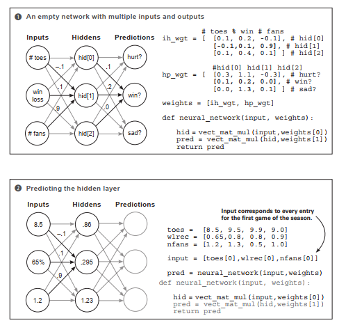

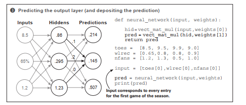

The following listing shows how you can do the same operations coded in the previous
section using a convenient Python library called NumPy. Using libraries like NumPy makes
your code faster and easier to read and write.

## NumPy version

```
import numpy as np
# toes % win # fans
ih_wgt = np.array([
[0.1, 0.2, -0.1], # hid[0]
[-0.1,0.1, 0.9], # hid[1]
[0.1, 0.4, 0.1]]).T # hid[2]
# hid[0] hid[1] hid[2]
hp_wgt = np.array([
[0.3, 1.1, -0.3], # hurt?
[0.1, 0.2, 0.0], # win?
[0.0, 1.3, 0.1] ]).T # sad?
weights = [ih_wgt, hp_wgt]
def neural_network(input, weights):
hid = input.dot(weights[0])
pred = hid.dot(weights[1])
return pred
toes = np.array([8.5, 9.5, 9.9, 9.0])
wlrec = np.array([0.65,0.8, 0.8, 0.9])
nfans = np.array([1.2, 1.3, 0.5, 1.0])
input = np.array([toes[0],wlrec[0],nfans[0]])
pred = neural_network(input,weights)
print(pred)
```

## A quick primer on NumPy

**NumPy does a few things for you. Let’s reveal the magic.**

So far in this lab, we’ve discussed two new types of mathematical tools: vectors and matrices.
You’ve also learned about different operations that occur on vectors and matrices, including dot
products, elementwise multiplication and addition, and vector-matrix multiplication. For these
operations, you’ve written Python functions that can operate on simple Python list objects.

In the short term, you’ll keep writing and
using these functions to be sure you fully
understand what’s going on inside them.
But now that I’ve mentioned NumPy and
several of the big operations, I’d like to
give you a quick rundown of basic NumPy
use so you’ll be ready for the transition to
NumPy-only chapters. Let’s start with the
basics again: vectors and matrices.

You can create vectors and matrices
in multiple ways in NumPy. Most of
the common techniques for neural
networks are listed in the previous code.
Note that the processes for creating
a vector and a matrix are identical.
If you create a matrix with only one
row, you’re creating a vector. And, as
in mathematics in general, you create
a matrix by listing (rows,columns).
I say that only so you can remember
the order: rows come first, columns
come second. Let’s see some operations
you can perform on these vectors and
matrices:

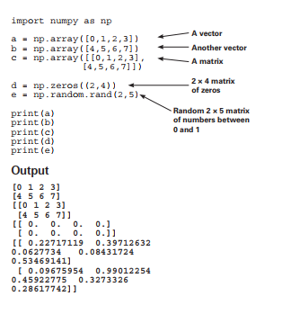

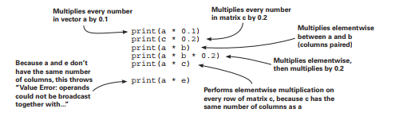

Go ahead and run all of the previous code. The first bit of "at first confusing but eventually
heavenly" magic should be visible. When you multiply two variables with the * function,
NumPy automatically detects what kinds of variables you’re working with and tries to figure
out the operation you’re talking about. This can be mega-convenient but sometimes makes
NumPy code a bit hard to read. Make sure you keep track of each variable type as you go along.

The general rule of thumb for anything elementwise (+, –, *, /) is that either the two
variables must have the same number of columns, or one of the variables must have only
one column. For example, print(a * 0.1) multiplies a vector by a single number (a
scalar). NumPy says, "Oh, I bet I’m supposed to do vector-scalar multiplication here," and
then multiples the scalar (0.1) by every value in the vector. This looks exactly the same as
print(c * 0.2), except NumPy knows that c is a matrix. Thus, it performs scalar-matrix
multiplication, multiplying every element in c by 0.2. Because the scalar has only one
column, you can multiply it by anything (or divide, add, or subtract).

Next up: print(a * b). NumPy first identifies that they’re both vectors. Because neither
vector has only one column, NumPy checks whether they have an identical number of
columns. They do, so NumPy knows to multiply each element by each element, based on
their positions in the vectors. The same is true with addition, subtraction, and division.
print(a * c) is perhaps the most elusive. a is a vector with four columns, and c is a
(2 × 4) matrix. Neither has only one column, so NumPy checks whether they have the
same number of columns. They do, so NumPy multiplies the vector a by each row of c
(as if it were doing elementwise vector multiplication on each row).

Again, the most confusing part is that all of these operations look the same if you don’t
know which variables are scalars, vectors, or matrices. When you "read NumPy," you’re really
doing two things: reading the operations and keeping track of the shape (number of rows and
columns) of each operation. It will take some practice, but eventually it becomes second nature.
Let’s look at a few examples of matrix multiplication in NumPy, noting the input and output shapes
of each matrix.

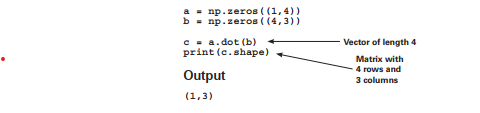

There’s one golden rule when using the dot function: if you put the (rows,cols) description
of the two variables you’re "dotting" next to each other, neighboring numbers should always be
the same. In this case, you’re dot-producting (1,4) with (4,3). It works fine and outputs (1,3).
In terms of variable shape, you can think of it as follows, regardless of whether you’re dotting
vectors or matrices: their shape (number of rows and columns) must line up. The columns of the
left matrix must equal the rows on the right, such that (a,b).dot(b,c) = (a,c).

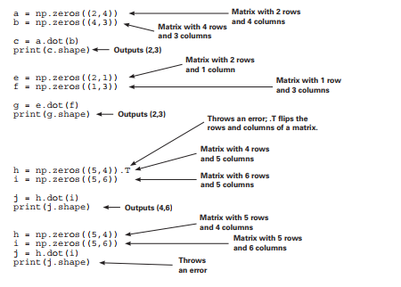

### Summary

**To predict, neural networks perform repeated weighted sums of the input.**

You’ve seen an increasingly complex variety of neural networks in this lab. I hope it’s clear
that a relatively small number of simple rules are used repeatedly to create larger, more advanced
neural networks. The network’s intelligence depends on the weight values you give it.

Everything we’ve done in this lab is a form of what’s called forward propagation, wherein
a neural network takes input data and makes a prediction. It’s called this because you’re
propagating activations forward through the network. In these examples, activations are all the
numbers that are not weights and are unique for every prediction.

In the next chapter, you’ll learn how to set weights so your neural networks make accurate
predictions. Just as prediction is based on several simple techniques that are repeated/stacked on
top of each other, weight learning is also a series of simple techniques that are combined many
times across an architecture. See you there!
