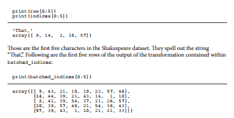
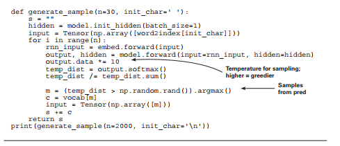
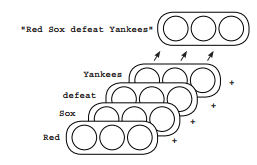

# Lab : Learning to write like Shakespeare: long short-term memory (Part 1)

#### Pre-reqs:
- Google Chrome (Recommended)

#### Lab Environment
Notebooks are ready to run. All packages have been installed. There is no requirement for any setup.

**Note:** Elev8ed Notebooks (powered by Jupyter) will be accessible at the port given to you by your instructor. Password for jupyterLab : `1234`

All Notebooks are present in `work/Grokking-Deep-Learning` folder. To copy and paste: use **Control-C** and to paste inside of a terminal, use **Control-V**

You can access jupyter lab at `<host-ip>:<port>/lab/workspaces/lab11_Exploding_Gradients`

##### Run Notebook
Click notebook `Chapter14 - Exploding Gradients Examples- Practice.ipynb` in jupterLab UI and run jupyter notebook. 
There are some placeholder(s) to write code in the notebook. You can get help from solution notebook `Chapter14 - Exploding Gradients Examples.ipynb` as well as lab guide. 
 
## Character language modeling
Let’s tackle a more challenging task with the RNN.

At the end of chapters 12 and 13, you trained vanilla recurrent neural networks (RNNs)
that learned a simple series prediction problem. But you were training over a toy dataset
of phrases that were synthetically generated using rules.

In this lab, you’ll attempt language modeling over a much more challenging dataset:
the works of Shakespeare. And instead of learning to predict the next word given the
previous words (as in the preceding chapter), the model will train on characters. It needs
to learn to predict the next character given the previous characters observed. Here’s what
I mean:


Whereas in chapters 12 and 13 the vocabulary was made up of the words from the dataset,
now the vocabulary is made up the characters in the dataset. As such, the dataset is also
transformed into a list of indices corresponding to characters instead of words. Above this is
the indices NumPy array:

```
embed = Embedding(vocab_size=len(vocab),dim=512)
model = RNNCell(n_inputs=512, n_hidden=512, n_output=len(vocab))

criterion = CrossEntropyLoss()
optim = SGD(parameters=model.get_parameters() + embed.get_parameters(),
alpha=0.05)
```

This code should all look familiar. It initializes the embeddings to be of dimensionality 8
and the RNN hidden state to be of size 512. The output weights are initialized as 0s (not
a rule, but I found it worked a bit better). Finally, you initialize the cross-entropy loss and
stochastic gradient descent optimizer.


## The need for truncated backpropagation
Backpropagating through 100,000 characters is intractable.

One of the more challenging aspects of reading code for RNNs is the mini-batching logic for
feeding in data. The previous (simpler) neural network had an inner for loop like this (the
bold part):

```
for iter in range(1000):
batch_size = 100
total_loss = 0

hidden = model.init_hidden(batch_size=batch_size)

for t in range(5):
input = Tensor(data[0:batch_size,t], autograd=True)
rnn_input = embed.forward(input=input)
output, hidden = model.forward(input=rnn_input, hidden=hidden)

target = Tensor(data[0:batch_size,t+1], autograd=True)
loss = criterion.forward(output, target)
loss.backward()
optim.step()
total_loss += loss.data
if(iter % 200 == 0):
p_correct = (target.data == np.argmax(output.data,axis=1)).mean()
print_loss = total_loss / (len(data)/batch_size)
print("Loss:",print_loss,"% Correct:",p_correct)
```

You might ask, "Why iterate to 5?" As it turns out, the previous dataset didn’t have any
example longer than six words. It read in five words and then attempted to predict the sixth.
Even more important is the backpropagation step. Consider when you did a simple
feedforward network classifying MNIST digits: the gradients always backpropagated all the
way through the network, right? They kept backpropagating until they reached the input
data. This allowed the network to adjust every weight to try to learn how to correctly predict
given the entire input example.

The recurrent example here is no different. You forward propagate through five input
examples and then, when you later call loss.backward(), it backpropagates gradients all
the way back through the network to the input datapoints. You can do this because you
aren’t feeding in that many input datapoints at a time. But the Shakespeare dataset has
100,000 characters! This is way too many to backpropagate through for every prediction.
What do you do?
You don’t! You backpropagate for a fixed number of steps into the past and then stop. This
is called truncated backpropagation, and it’s the industry standard. The length you backprop
becomes another tunable parameter (like batch size or alpha).


## Truncated backpropagation
Technically, it weakens the theoretical maximum
of the neural network.

The downside of using truncated backpropagation is that it shortens the distance a neural
network can learn to remember things. Basically, cutting off gradients after, say, five
timesteps, means the neural network can’t learn to remember events that are longer than five
timesteps in the past.

Strictly speaking, it’s more nuanced than this. There can accidentally be residual information
in an RNN’s hidden layer from more than five timesteps in the past, but the neural network
can’t use gradients to specifically request that the model keep information around from six
timesteps in the past to help with the current prediction. Thus, in practice, neural networks
won’t learn to make predictions based on input signal from more than five timesteps in the
past (if truncation is set at five timesteps). In practice, for language modeling, the truncation
variable is called bptt, and it’s usually set somewhere between 16 and 64:

```
batch_size = 32
bptt = 16
n_batches = int((indices.shape[0] / (batch_size)))
```

The other downside of truncated backpropagation is that it makes the mini-batching logic a
bit more complex. To use truncated backpropagation, you pretend that instead of having one
big dataset, you have a bunch of small datasets of size bptt. You need to group the datasets
accordingly:

```
trimmed_indices = indices[:n_batches*batch_size]
batched_indices = trimmed_indices.reshape(batch_size, n_batches)
batched_indices = batched_indices.transpose()

input_batched_indices = batched_indices[0:-1]
target_batched_indices = batched_indices[1:]

n_bptt = int(((n_batches-1) / bptt))
input_batches = input_batched_indices[:n_bptt*bptt]
input_batches = input_batches.reshape(n_bptt,bptt,batch_size)
target_batches = target_batched_indices[:n_bptt*bptt]
target_batches = target_batches.reshape(n_bptt, bptt, batch_size)
```

There’s a lot going on here. The top line makes the dataset an even multiple between the
batch_size and n_batches. This is so that when you group it into tensors, it’s square
(alternatively, you could pad the dataset with 0s to make it square). The second and third
lines reshape the dataset so each column is a section of the initial indices array. I’ll show
you that part, as if batch_size was set to 8 (for readability):



I’ve highlighted the first column in bold. See how the indices for the phrase "That," are in the
first column on the left? This is a standard construction. The reason there are eight columns
is that the batch_size is 8. This tensor is then used to construct a list of smaller datasets,
each of length bptt.

You can see here how the input and target are constructed. Notice that the target indices are
the input indices offset by one row (so the network predicts the next character). Note again
that batch_size is 8 in this printout so it’s easier to read, but you’re really setting it to 32.

```
print(input_batches[0][0:5])

print(target_batches[0][0:5])

array([[ 9, 43, 21, 10, 10, 23, 57, 46],
[14, 44, 39, 21, 43, 14, 1, 10],
[ 2, 41, 39, 54, 37, 21, 26, 57],
[10, 39, 57, 48, 21, 54, 38, 43],
[57, 39, 43, 1, 10, 21, 21, 33]])
array([[14, 44, 39, 21, 43, 14, 1, 10],
[ 2, 41, 39, 54, 37, 21, 26, 57],
[10, 39, 57, 48, 21, 54, 38, 43],
[57, 39, 43, 1, 10, 21, 21, 33],
[43, 43, 41, 60, 52, 12, 54, 1]])
```

Don’t worry if this doesn’t make sense to you yet. It doesn’t have much to do with deep learning
theory; it’s just a particularly complex part of setting up RNNs that you’ll run into from time to
time. I thought I’d spend a couple of pages explaining it.


## Let’s see how to iterate using truncated backpropagation.

The following code shows truncated backpropagation in practice. Notice that it looks very
similar to the iteration logic from chapter 13. The only real difference is that you generate
a batch_loss at each step; and after every bptt steps, you backpropagate and perform a
weight update. Then you keep reading through the dataset like nothing happened (even
using the same hidden state from before, which only gets reset with each epoch):


## A sample of the output
By sampling from the predictions of the model,
you can write Shakespeare!

The following code uses a subset of the training logic to make predictions using the model.
You store the predictions in a string and return the string version as output to the function.
The sample that’s generated looks quite Shakespearian and even includes characters talking:



<h6>

I war ded abdons would.
CHENRO:

Why, speed no virth to her,
Plirt, goth Plish love,
Befion
hath if be fe woulds is feally your hir, the confectife to the nightion
As rent Ron my hath iom
the worse, my goth Plish love,
Befion
Ass untrucerty of my fernight this we namn?

ANG, makes:
That's bond confect fe comes not commonour would be forch the conflill
As
poing from your jus eep of m look o perves, the worse, my goth
Thould be good lorges ever word

DESS:
Where exbinder: if not conflill, the confectife to the nightion
As co move, sir, this we namn?

ANG VINE PAET:
There was courter hower how, my goth Plish lo res
Toures
ever wo formall, have abon, with a good lorges ever word.

</h6>

## Vanishing and exploding gradients
Vanilla RNNs suffer from vanishing and exploding gradients.

You may recall this image from when you first put together a RNN. The idea was to be able
to combine the word embeddings in a way that order mattered. You did this by learning a
matrix that transformed each embedding to the next timestep. Forward propagation then
became a two-step process: start with the first word embedding (the embedding for "Red" in
the following example), multiply by the weight matrix, and add the next embedding ("Sox").
You then take the resulting vector, multiply it by the same weight matrix, and then add in
the next word, repeating until you’ve read in the entire series of words.



But as you know, an additional nonlinearity
was added to the hidden state-generation
process. Thus, forward propagation becomes
a three-step process: matrix multiply the
previous hidden state by a weight matrix,
add in the next word’s embedding, and apply
a nonlinearity.


Note that this nonlinearity plays an
important role in the stability of the
network. No matter how long the sequence
of words is, the hidden states (which could
in theory grow larger and larger over time) are forced to stay between the values of the
nonlinearity (between 0 and 1, in the case of a sigmoid). But backpropagation happens in
a slightly different way than forward propagation, which doesn’t have this nice property.
Backpropagation tends to lead to either extremely large or extremely small values. Large
values can cause divergence (lots of not-a-numbers [NaNs]), whereas extremely small values
keep the network from learning. Let’s take a closer look at RNN backpropagation.

## A toy example of RNN backpropagation
To see vanishing/exploding gradients firsthand,
let’s synthesize an example.

The following code shows a recurrent backpropagation loop for sigmoid and relu
activations. Notice how the gradients become very small/large for sigmoid/relu,
respectively. During backprop, they become large as the result of the matrix multiplication,
and small as a result of the sigmoid activation having a very flat derivative at its tails
(common for many nonlinearities).


###  Next
In the next lab, we will look into Long short-term memory (LSTM) cells.
