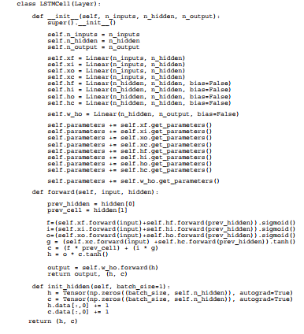
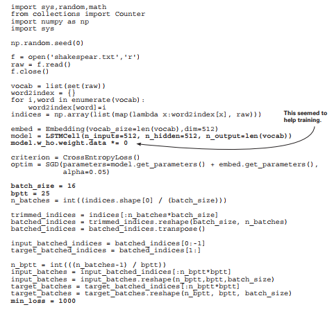
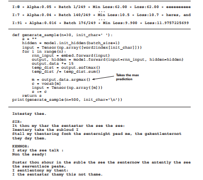

# Lab : Learning to write like Shakespeare: long short-term memory (Part 2)

#### Pre-reqs:
- Google Chrome (Recommended)

#### Lab Environment
Notebooks are ready to run. All packages have been installed. There is no requirement for any setup.

**Note:** Elev8ed Notebooks (powered by Jupyter) will be accessible at the port given to you by your instructor. Password for jupyterLab : `1234`

All Notebooks are present in `work/Grokking-Deep-Learning` folder. To copy and paste: use **Control-C** and to paste inside of a terminal, use **Control-V**

You can access jupyter lab at `<host-ip>:<port>/lab/workspaces/lab12_LSTMs`

##### Run Notebook
Click notebook `Chapter14 - Intro to LSTMs - Learn to Write Like Shakespeare- Practice.ipynb` in jupterLab UI and run jupyter notebook. 
There are some placeholder(s) to write code in the notebook. You can get help from solution notebook `Chapter14 - Intro to LSTMs - Learn to Write Like Shakespeare.ipynb` as well as lab guide.
 
 
##### Run Notebook
Click notebook `Chapter14 - Intro to LSTMs - Part 2 - Learn to Write Like Shakespeare- Practice.ipynb` in jupterLab UI and run jupyter notebook. 
There are some placeholder(s) to write code in the notebook. You can get help from solution notebook `Chapter14 - Intro to LSTMs - Part 2 - Learn to Write Like Shakespeare.ipynb` as well as lab guide.
 
<h4><span style="color:red;">Long short-term memory (LSTM) cells</span></h4>

**LSTMs are the industry standard model to counter vanishing/exploding gradients.**

The previous lab explained how vanishing/exploding gradients result from the
way hidden states are updated in a RNN. The problem is the combination of matrix
multiplication and nonlinearity being used to form the next hidden state. The solution that
LSTMs provide is surprisingly simple.

**The gated copy trick**

LSTMs create the next hidden state by copying the previous hidden state and then
adding or removing information as necessary. The mechanisms the LSTM uses for adding
and removing information are called gates.

```
def forward(self, input, hidden):
from_prev_hidden = self.w_hh.forward(hidden)
combined = self.w_ih.forward(input) + from_prev_hidden
new_hidden = self.activation.forward(combined)
output = self.w_ho.forward(new_hidden)
return output, new_hidden
```

The previous code is the forward propagation logic for the RNN cell. Following is the new
forward propagation logic for the LSTM cell. The LSTM has two hidden state vectors: h (for
hidden) and cell.

The one you care about is cell. Notice how it’s updated. Each new cell is the previous cell
plus u, weighted by i and f. f is the "forget" gate. If it takes a value of 0, the new cell will
erase what it saw previously. If i is 1, it will fully add in the value of u to create the new cell.
o is an output gate that controls how much of the cell’s state the output prediction is allowed
to see. For example, if o is all zeros, then the self.w_ho.forward(h) line will make a
prediction ignoring the cell state entirely.

```
def forward(self, input, hidden):

prev_hidden, prev_cell = (hidden[0], hidden[1])

f = (self.xf.forward(input) +
i = (self.xi.forward(input) +
o = (self.xo.forward(input) +
u = (self.xc.forward(input) +
cell = (f * prev_cell) + (i *
h = o * cell.tanh()
output = self.w_ho.forward(h)
return output, (h, cell)

self.hf.forward(prev_hidden)).sigmoid()
self.hi.forward(prev_hidden)).sigmoid()
self.ho.forward(prev_hidden)).sigmoid()
self.hc.forward(prev_hidden)).tanh()
u)
```


## Some intuition about LSTM gates
LSTM gates are semantically similar to reading/writing
from memory.

So there you have it! There are three gates—f, i, o—and a cell-update vector u; think of
these as forget, input, output, and update, respectively. They work together to ensure that
any information to be stored or manipulated in c can be so without requiring each update
of c to have any matrix multiplications or nonlinearities applied to it. In other words, you’re
avoiding ever calling nonlinearity(c) or c.dot(weights).

This is what allows the LSTM to store information across a time series without worrying
about vanishing or exploding gradients. Each step is a copy (assuming f is nonzero) plus
an update (assuming i is nonzero). The hidden value h is then a masked version of the cell
that’s used for prediction.

Notice further that each of the three gates is formed the same way. They have their own
weight matrices, but each of them conditions on the input and the previous hidden state,
passed through a sigmoid. It’s this sigmoid nonlinearity that makes them so useful as gates,
because it saturates at 0 and 1:

```
f = (self.xf.forward(input) + self.hf.forward(prev_hidden)).sigmoid()
i = (self.xi.forward(input) + self.hi.forward(prev_hidden)).sigmoid()
o = (self.xo.forward(input) + self.ho.forward(prev_hidden)).sigmoid()
```

One last possible critique is about h. Clearly it’s still prone to vanishing and exploding
gradients, because it’s basically being used the same as the vanilla RNN. First, because the
h vector is always created using a combination of vectors that are squished with tanh and
sigmoid, exploding gradients aren’t really a problem—only vanishing gradients. But this
ends up being OK because h is conditioned on c, which can carry long-range information:
the kind of information vanishing gradients can’t learn to carry. Thus, all long-range
information is transported using c, and h is only a localized interpretation of c, useful for
making an output prediction and constructing gate activations at the following timestep. In
short, c can learn to transport information over long distances, so it doesn’t matter if h can’t.


## The long short-term memory layer
You can use the autograd system to implement an LSTM.




## Upgrading the character language model
Let’s swap out the vanilla RNN with the new LSTM cell.

Earlier in this lab, you trained a character language model to predict Shakespeare.
Now let’s train an LSTM-based model to do the same. Fortunately, the framework from the
preceding chapter makes this easy to do (the complete code from the book’s website, www.
manning.com/books/grokking-deep-learning; or on GitHub at https://github.com/iamtrask/
grokking-deep-learning). Here’s the new setup code. All edits from the vanilla RNN code are
in bold. Notice that hardly anything has changed about how you set up the neural network:




## Training the LSTM character language model
The training logic also hasn’t changed much.

The only real change you have to make from the vanilla RNN logic is the truncated
backpropagation logic, because there are two hidden vectors per timestep instead of one.
But this is a relatively minor fix (in bold). I’ve also added a few bells and whistles that make
training easier (alpha slowly decreases over time, and there’s more logging):

```
for iter in range(iterations):
total_loss, n_loss = (0, 0)

hidden = model.init_hidden(batch_size=batch_size)
batches_to_train = len(input_batches)

for batch_i in range(batches_to_train):

hidden = (Tensor(hidden[0].data, autograd=True),
Tensor(hidden[1].data, autograd=True))
losses = list()

for t in range(bptt):
input = Tensor(input_batches[batch_i][t], autograd=True)
rnn_input = embed.forward(input=input)
output, hidden = model.forward(input=rnn_input, hidden=hidden)

target = Tensor(target_batches[batch_i][t], autograd=True)
batch_loss = criterion.forward(output, target)

if(t == 0):
losses.append(batch_loss)
else:
losses.append(batch_loss + losses[-1])
loss = losses[-1]

loss.backward()
optim.step()

total_loss += loss.data / bptt
epoch_loss = np.exp(total_loss / (batch_i+1))
if(epoch_loss < min_loss):
min_loss = epoch_loss
print()
log = "\r Iter:" + str(iter)
log += " - Alpha:" + str(optim.alpha)[0:5]
log += " - Batch "+str(batch_i+1)+"/"+str(len(input_batches))
log += " - Min Loss:" + str(min_loss)[0:5]
log += " - Loss:" + str(epoch_loss)
if(batch_i == 0):
s = generate_sample(n=70, init_char='T').replace("\n"," ")
log += " - " + s
sys.stdout.write(log)
optim.alpha *= 0.99
```

<h4><span style="color:red;">Tuning the LSTM character language model</span></h4>

**I spent about two days tuning this model, and it trained overnight.**

Here’s some of the training output for this model. Note that it took a very long time to
train (there are a lot of parameters). I also had to train it many times in order to find a
good tuning (learning rate, batch size, and so on) for this task, and the final model trained
overnight (8 hours). In general, the longer you train, the better your results will be.



<h6>

Intestay thee.

SIR:
It thou my thar the sentastar the see the see:
Imentary take the subloud I
Stall my thentaring fook the senternight pead me, the gakentlenternot
they day them.

KENNOR:
I stay the see talk :
Non the seady!

Sustar thou shour in the suble the see the senternow the antently the see
the seaventlace peake,
I sentlentony my thent:
I the sentastar thamy this not thame.

</h6>

### Summary
LSTMs are incredibly powerful models.

The distribution of Shakespearian language that the LSTM learned to generate isn’t to be
taken lightly. Language is an incredibly complex statistical distribution to learn, and the
fact that LSTMs can do so well (at the time of writing, they’re the state-of-the-art approach
by a wide margin) still baffles me (and others as well). Small variants on this model either
are or have recently been the state of the art in a wide variety of tasks and, alongside word
embeddings and convolutional layers, will undoubtedly be one of our go-to tools for a long
time to come.
