# Lab : Deep learning on unseen data: introducing federated learning

#### Pre-reqs:
- Google Chrome (Recommended)

You can access jupyter lab at `<host-ip>:<port>/lab/workspaces/Deep_Learning`


## What is deep learning?
Deep learning is a subset of methods for machine learning.

Deep learning is a subset of machine learning, which is a field dedicated to the study and
development of machines that can learn (sometimes with the goal of eventually attaining
general artificial intelligence).

In industry, deep learning is used to solve practical tasks in a variety of fields such as
computer vision (image), natural language processing (text), and automatic speech
recognition (audio). In short, deep learning is a subset of methods in the machine learning
toolbox, primarily using artificial neural networks, which are a class of algorithm loosely
inspired by the human brain.

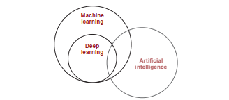

Notice in this figure that not all of deep learning is focused around pursuing generalized
artificial intelligence (sentient machines as in the movies). Many applications of this
technology are used to solve a wide variety of problems in industry. This book seeks to
focus on teaching the fundamentals of deep learning behind both cutting-edge research and
industry, helping to prepare you for either.


## What is machine learning?


A field of study that gives computers the ability to learn without being
explicitly programmed.
			
—Attributed to Arthur Samuel

Given that deep learning is a subset of machine learning, what is machine learning? Most
generally, it is what its name implies. Machine learning is a subfield of computer science
wherein machines learn to perform tasks for which they were not explicitly programmed.
In short, machines observe a pattern and attempt to imitate it in some way that can be either
direct or indirect.


I mention direct and indirect imitation as a parallel to the two main types of machine
learning: supervised and unsupervised. Supervised machine learning is the direct imitation
of a pattern between two datasets. It’s always attempting to take an input dataset and
transform it into an output dataset. This can be an incredibly powerful and useful capability.
Consider the following examples (input datasets in bold and output datasets in italic):

- Using the pixels of an image to detect the presence or absence of a cat
- Using the movies you’ve liked to predict more movies you may like
- Using someone’s words to predict whether they’re happy or sad
- Using weather sensor data to predict the probability of rain
- Using car engine sensors to predict the optimal tuning settings
- Using news data to predict tomorrow’s stock price
- Using an input number to predict a number double its size
- Using a raw audio file to predict a transcript of the audio

These are all supervised machine learning tasks. In all cases, the machine learning algorithm
is attempting to imitate the pattern between the two datasets in such a way that it can use
one dataset to predict the other. For any of these examples, imagine if you had the power to
predict the output dataset given only the input dataset. Such an ability would be profound.


## Supervised machine learning
Supervised learning transforms datasets.

Supervised learning is a method for transforming one dataset into another. For example, if
you had a dataset called Monday Stock Prices that recorded the price of every stock on every
Monday for the past 10 years, and a second dataset called Tuesday Stock Prices recorded
over the same time period, a supervised learning algorithm might try to use one to predict
the other.


If you successfully trained the supervised machine learning algorithm on 10 years of
Mondays and Tuesdays, then you could predict the stock price on any Tuesday in the future
given the stock price on the immediately preceding Monday. I encourage you to stop and
consider this for a moment.

Supervised machine learning is the bread and butter of applied artificial intelligence (also
known as narrow AI). It’s useful for taking what you know as input and quickly transforming
it into what you want to know. This allows supervised machine learning algorithms to
extend human intelligence and capabilities in a seemingly endless number of ways.

The majority of work using machine learning results in the training of a supervised classifier
of some kind. Even unsupervised machine learning (which you’ll learn more about in a
moment) is typically done to aid in the development of an accurate supervised machine
learning algorithm.

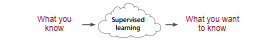

For the rest of this book, you’ll be creating algorithms that can take input data that is
observable, recordable, and, by extension, knowable and transform it into valuable output
data that requires logical analysis. This is the power of supervised machine learning.


## Unsupervised machine learning
Unsupervised learning groups your data.

Unsupervised learning shares a property in common with supervised learning: it transforms
one dataset into another. But the dataset that it transforms into is not previously known or
understood. Unlike supervised learning, there is no "right answer" that you’re trying to get
the model to duplicate. You just tell an unsupervised algorithm to "find patterns in this data
and tell me about them."

For example, clustering a dataset into groups is a type of unsupervised learning. Clustering
transforms a sequence of datapoints into a sequence of cluster labels. If it learns 10 clusters,
it’s common for these labels to be the numbers 1–10. Each datapoint will be assigned to a
number based on which cluster it’s in. Thus, the dataset turns from a bunch of datapoints
into a bunch of labels. Why are the labels numbers? The algorithm doesn’t tell you what the
clusters are. How could it know? It just says, "Hey scientist! I found some structure. It looks
like there are groups in your data. Here they are!"

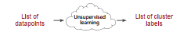

I have good news! This idea of clustering is something you can reliably hold onto in your
mind as the definition of unsupervised learning. Even though there are many forms
of unsupervised learning, all forms of unsupervised learning can be viewed as a form of
clustering. You’ll discover more on this later in the book.

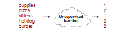

Check out this example. Even though the algorithm didn’t tell what the clusters are named,
can you figure out how it clustered the words? (Answer: 1 == cute and 2 == delicious.) Later,
we’ll unpack how other forms of unsupervised learning are also just a form of clustering and
why these clusters are useful for supervised learning.


## Parametric vs. nonparametric learning
Oversimplified: Trial-and-error learning vs. counting
and probability

The last two pages divided all machine learning algorithms into two groups: supervised and
unsupervised. Now, we’re going to discuss another way to divide the same machine learning
algorithms into two groups: parametric and nonparametric. So, if we think about our little
machine learning cloud, it has two settings:


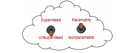

As you can see, there are really four different types of algorithms to choose from. An
algorithm is either unsupervised or supervised, and either parametric or nonparametric.
Whereas the previous section on supervision is about the type of pattern being learned,
parametricism is about the way the learning is stored and often, by extension, the
method for learning. First, let’s look at the formal definitions of parametricism versus
nonparametricism. For the record, there’s still some debate around the exact difference.

A parametric model is characterized by having a fixed number of parameters, whereas
a nonparametric model’s number of parameters is infinite (determined by data).

As an example, let’s say the problem is to fit a square peg into the correct (square)
hole. Some humans (such as babies) just jam it into all the holes until it fits somewhere
(parametric). A teenager, however, may count the number of sides (four) and then search
for the hole with an equal number (nonparametric). Parametric models tend to use trial and
error, whereas nonparametric models tend to count. Let’s look closer.


## Supervised parametric learning
Oversimplified: Trial-and-error learning using knobs

Supervised parametric learning machines are machines with a fixed number of knobs (that’s
the parametric part), wherein learning occurs by turning the knobs. Input data comes in, is
processed based on the angle of the knobs, and is transformed into a prediction.

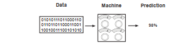

Learning is accomplished by turning the knobs to different angles. If you’re trying to predict
the probability that the Red Sox will win the World Series, then this model would first take
data (such as sports stats like win/loss record or average number of toes per player) and
make a prediction (such as 98% chance). Next, the model would observe whether or not
the Red Sox actually won. After it knew whether they won, the learning algorithm would
update the knobs to make a more accurate prediction the next time it sees the same
or similar input data.

Perhaps it would "turn up" the "win/loss record" knob if the team’s win/loss record was a
good predictor. Inversely, it might "turn down" the "average number of toes" knob if that
datapoint wasn’t a good predictor. This is how parametric models learn!
Note that the entirety of what the model has learned can be captured in the positions
of the knobs at any given time. You can also think of this type of learning model as a
search algorithm. You’re "searching" for the appropriate knob configuration by trying
configurations, adjusting them, and retrying.

Note further that the notion of trial and error isn’t the formal definition, but it’s a common
(with exceptions) property to parametric models. When there is an arbitrary (but
fixed) number of knobs to turn, some level of searching is required to find the optimal
configuration. This is in contrast to nonparametric learning, which is often count based
and (more or less) adds new knobs when it finds something new to count. Let’s break down
supervised parametric learning into its three steps.


**Step 1: Predict**

To illustrate supervised parametric learning, let’s continue with the sports analogy of trying
to predict whether the Red Rox will win the World Series. The first step, as mentioned, is to
gather sports statistics, send them through the machine, and make a prediction about the
probability that the Red Sox will win.

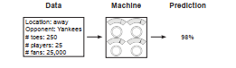

**Step 2: Compare to the truth pattern**

The second step is to compare the prediction (98%) with the pattern you care about
(whether the Red Sox won). Sadly, they lost, so the comparison is

```
Pred: 98% > Truth: 0%
```

This step recognizes that if the model had predicted 0%, it would have perfectly predicted the
upcoming loss of the team. You want the machine to be accurate, which leads to step 3.

**Step 3: Learn the pattern**

This step adjusts the knobs by studying both how much
the model missed by (98%) and what the input data was
(sports stats) at the time of prediction. This step then turns
the knobs to make a more accurate prediction given the
input data.

In theory, the next time this step saw the same sports stats,
the prediction would be lower than 98%. Note that each
knob represents the prediction’s sensitivity to different types
of input data. That’s what you’re changing when you "learn."

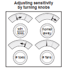


## Unsupervised parametric learning

Unsupervised parametric learning uses a very similar approach. Let’s walk through the
steps at a high level. Remember that unsupervised learning is all about grouping data.
Unsupervised parametric learning uses knobs to group data. But in this case, it usually
has several knobs for each group, each of which maps
the input data’s affinity to that particular group (with
exceptions and nuance—this is a high-level description).
Let’s look at an example that assumes you want to divide
the data into three groups.

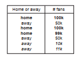

In the dataset, I’ve identified three clusters in the data that
you might want the parametric model to find. They’re
indicated via formatting as group 1, group 2, and group
3. Let’s propagate the first datapoint through a trained
unsupervised model, as shown next. Notice that it maps
most strongly to group 1.

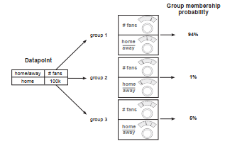

Each group’s machine attempts to transform the input data to a number between 0 and 1,
telling us the probability that the input data is a member of that group. There is a great deal
of variety in how these models train and their resulting properties, but at a high level they
adjust parameters to transform the input data into its subscribing group(s).


<h4><span style="color:red;">Nonparametric learning </span></h4>


Oversimplified: Counting-based methods

Nonparametric learning is a class of algorithm wherein the number of parameters is based
on data (instead of predefined). This lends itself to methods that generally count in one way
or another, thus increasing the number of parameters based on the number of items being
counted within the data. In the supervised setting, for example, a nonparametric model
might count the number of times a particular color of streetlight causes cars to "go." After
counting only a few examples, this model would then be able to predict that middle lights
always (100%) cause cars to go, and right lights only sometimes (50%) cause cars to go.

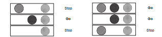

Notice that this model would have three parameters: three counts indicating the number
of times each colored light turned on and cars would go (perhaps divided by the number
of total observations). If there were five lights, there would be five counts (five parameters).
What makes this simple model nonparametric is this trait wherein the number of parameters
changes based on the data (in this case, the number of lights). This is in contrast to
parametric models, which start with a set number of parameters and, more important, can
have more or fewer parameters purely at the discretion of the scientist training the model
(regardless of data).

A close eye might question this idea. The parametric model from before seemed to have
a knob for each input datapoint. Most parametric models still have to have some sort of
input based on the number of classes in the data. Thus you can see that there is a gray
area between parametric and nonparametric algorithms. Even parametric algorithms are
somewhat influenced by the number of classes in the data, even if they aren’t explicitly
counting patterns.

This also illuminates that parameters is a generic term, referring only to the set of numbers
used to model a pattern (without any limitation on how those numbers are used). Counts
are parameters. Weights are parameters. Normalized variants of counts or weights are
parameters. Correlation coefficients can be parameters. The term refers to the set of
numbers used to model a pattern. As it happens, deep learning is a class of parametric
models. We won’t discuss nonparametric models further in this book, but they’re an
interesting and powerful class of algorithm.


### Summary

In this lab, we’ve gone a level deeper into the various flavors of machine learning.
You learned that a machine learning algorithm is either supervised or unsupervised
and either parametric or nonparametric. Furthermore, we explored exactly what makes
these four different groups of algorithms distinct. You learned that supervised machine
learning is a class of algorithm where you learn to predict one dataset given another and
that unsupervised learning generally groups a single dataset into various kinds of clusters.
You learned that parametric algorithms have a fixed number of parameters and that
nonparametric algorithms adjust their number of parameters based on the dataset.

Deep learning uses neural networks to perform both supervised and unsupervised
prediction. Until now, we’ve stayed at a conceptual level as you got your bearings in the field
as a whole and your place in it. In the next lab, you’ll build your first neural network,
and all subsequent chapters will be project based. So, pull out your Jupyter notebook, and
let’s jump in!

