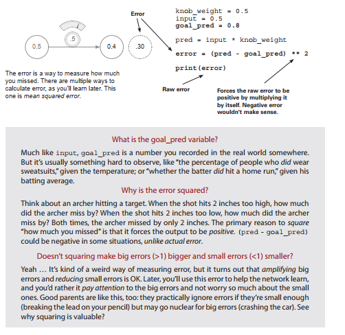
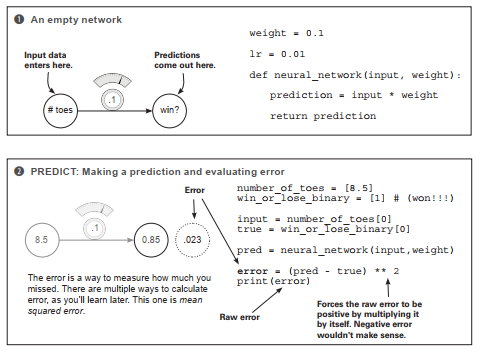

# Lab : Introduction to neural learning: gradient descent

#### Pre-reqs:
- Google Chrome (Recommended)

#### Lab Environment
Notebooks are ready to run. All packages have been installed. There is no requirement for any setup.

**Note:** Elev8ed Notebooks (powered by Jupyter) will be accessible at the port given to you by your instructor. Password for jupyterLab : `1234`

All Notebooks are present in `work/Grokking-Deep-Learning` folder. To copy and paste: use **Control-C** and to paste inside of a terminal, use **Control-V**

You can access jupyter lab at `<host-ip>:<port>/lab/workspaces/lab2_Gradient_Descent`

<h4><span style="color:red;"> Predict, compare, and learn</span></h4>
 
In chapter 3, you learned about the paradigm "predict, compare, learn," and we dove
deep into the first step: predict. In the process, you learned a myriad of things, including
the major parts of neural networks (nodes and weights), how datasets fit into networks
(matching the number of datapoints coming in at one time), and how to use a neural
network to make a prediction.
Perhaps this process begged the question, "How do we set weight values so the network
predicts accurately?" Answering this question is the main focus of this lab, as we
cover the next two steps of the paradigm: compare and learn.

## Compare
Comparing gives a measurement of how much a prediction
"missed" by.
Once you’ve made a prediction, the next step is to evaluate how well you did. This may
seem like a simple concept, but you’ll find that coming up with a good way to measure
error is one of the most important and complicated subjects of deep learning.

There are many properties of measuring error that you’ve likely been doing your whole
life without realizing it. Perhaps you (or someone you know) amplify bigger errors while
ignoring very small ones. In this lab, you’ll learn how to mathematically teach a network
to do this. You’ll also learn that error is always positive! We’ll consider the analogy of an
archer hitting a target: whether the shot is too low by an inch or too high by an inch, the
error is still just 1 inch. In the neural network compare step, you need to consider these
kinds of properties when measuring error.

As a heads-up, in this lab we evaluate only one simple way of measuring error: mean
squared error. It’s but one of many ways to evaluate the accuracy of a neural network.
This step will give you a sense for how much you missed, but that isn’t enough to be able to
learn. The output of the compare logic is a "hot or cold" type signal. Given some prediction,
you’ll calculate an error measure that says either "a lot" or "a little." It won’t tell you why you
missed, what direction you missed, or what you should do to fix the error. It more or less
says "big miss," "little miss," or "perfect prediction." What to do about the error is captured
in the next step, learn.


## Learn

Learn
Learning tells each weight how it can change to reduce the error.
Learning is all about error attribution, or the art of figuring out how each weight played
its part in creating error. It’s the blame game of deep learning. In this lab, we’ll
spend many pages looking at the most popular version of the deep learning blame game:
gradient descent.

At the end of the day, it results in computing a number for each weight. That number
represents how that weight should be higher or lower in order to reduce the error. Then
you’ll move the weight according to that number, and you’ll be finished.


<h4><span style="color:red;"> Compare: Does your network make
good predictions?</span></h4>

Let’s measure the error and find out!

Execute the following code in your Jupyter notebook. It should print 0.3025:



## What is the goal_pred variable?
Much like input, goal_pred is a number you recorded in the real world somewhere.
But it’s usually something hard to observe, like "the percentage of people who did wear
sweatsuits," given the temperature; or "whether the batter did hit a home run," given his
batting average.

## Why is the error squared?

Think about an archer hitting a target. When the shot hits 2 inches too high, how much
did the archer miss by? When the shot hits 2 inches too low, how much did the archer
miss by? Both times, the archer missed by only 2 inches. The primary reason to square
"how much you missed" is that it forces the output to be positive. (pred - goal_pred)
could be negative in some situations, unlike actual error.

## Doesn’t squaring make big errors (>1) bigger and small errors (<1) smaller?
Yeah … It’s kind of a weird way of measuring error, but it turns out that amplifying big
errors and reducing small errors is OK. Later, you’ll use this error to help the network learn,
and you’d rather it pay attention to the big errors and not worry so much about the small
ones. Good parents are like this, too: they practically ignore errors if they’re small enough
(breaking the lead on your pencil) but may go nuclear for big errors (crashing the car). See
why squaring is valuable?


<h4><span style="color:red;"> Why measure error? </span></h4>


Measuring error simplifies the problem.
The goal of training a neural network is to make correct predictions. That’s what you want.
And in the most pragmatic world (as mentioned in the preceding chapter), you want the
network to take input that you can easily calculate (today’s stock price) and predict things that
are hard to calculate (tomorrow’s stock price). That’s what makes a neural network useful.
It turns out that changing knob_weight to make the network correctly predict
goal_prediction is slightly more complicated than changing knob_weight to make
error == 0. There’s something more concise about looking at the problem this way.
Ultimately, both statements say the same thing, but trying to get the error to 0 seems
more straightforward.

**Different ways of measuring error prioritize error differently**

If this is a bit of a stretch right now, that’s OK, but think back to what I said earlier: by
squaring the error, numbers that are less than 1 get smaller, whereas numbers that are greater
than 1 get bigger. You’re going to change what I call pure error (pred - goal_pred) so that
bigger errors become very big and smaller errors quickly become irrelevant.
By measuring error this way, you can prioritize big errors over smaller ones. When you have
somewhat large pure errors (say, 10), you’ll tell yourself that you have very large error (10**2 ==
100); and in contrast, when you have small pure errors (say, 0.01), you’ll tell yourself that you
have very small error (0.01**2 == 0.0001). See what I mean about prioritizing? It’s just modifying
what you consider to be error so that you amplify big ones and largely ignore small ones.
In contrast, if you took the absolute value instead of squaring the error, you wouldn’t have this
type of prioritization. The error would just be the positive version of the pure error—which
would be fine, but different. More on this later.

**Why do you want only positive error?**

Eventually, you’ll be working with millions of input -> goal_prediction pairs, and we’ll
still want to make accurate predictions. So, you’ll try to take the average error down to 0.
This presents a problem if the error can be positive and negative. Imagine if you were
trying to get the neural network to correctly predict two datapoints—two input ->
goal_prediction pairs. If the first had an error of 1,000 and the second had an error of
–1,000, then the average error would be zero! You’d fool yourself into thinking you predicted
perfectly, when you missed by 1,000 each time! That would be really bad. Thus, you want the
error of each prediction to always be positive so they don’t accidentally cancel each other out
when you average them.


## What’s the simplest form of neural learning?
Learning using the hot and cold method

At the end of the day, learning is really about one thing: adjusting knob_weight either up
or down so the error is reduced. If you keep doing this and the error goes to 0, you’re done
learning! How do you know whether to turn the knob up or down? Well, you try both up and
down and see which one reduces the error! Whichever one reduces the error is used to update
knob_weight. It’s simple but effective. After you do this over and over again, eventually
error == 0, which means the neural network is predicting with perfect accuracy.

**Hot and cold learning**

Hot and cold learning means wiggling the weights to see which direction reduces the error
the most, moving the weights in that direction, and repeating until the error gets to 0.




These last five steps are one iteration of hot and cold learning. Fortunately, this iteration got
us pretty close to the correct answer all by itself (the new error is only 0.004). But under
normal circumstances, we’d have to repeat this process many times to find the correct
weights. Some people have to train their networks for weeks or months before they find a
good enough weight configuration.

This reveals what learning in neural networks really is: a search problem. You’re searching
for the best possible configuration of weights so the network’s error falls to 0 (and predicts
perfectly). As with all other forms of search, you might not find exactly what you’re looking
for, and even if you do, it may take some time. Next, we’ll use hot and cold learning for a
slightly more difficult prediction so you can see this searching in action!

<h4><span style="color:red;"> Hot and cold learning</span></h4>

This is perhaps the simplest form of learning.

Execute the following code in your Jupyter notebook. (New neural network modifications
are in bold.) This code attempts to correctly predict 0.8:


## Characteristics of hot and cold learning
It’s simple.

Hot and cold learning is simple. After making a prediction, you predict two more times, once with a
slightly higher weight and again with a slightly lower weight. You then move weight depending on
which direction gave a smaller error. Repeating this enough times eventually reduces error to 0.

**Why did I iterate exactly 1,101 times?**
The neural network in the example reaches 0.8 after exactly that many iterations. If you
go past that, it wiggles back and forth between 0.8 and just above or below 0.8, making
for a less pretty error log printed at the bottom of the left page. Feel free to try it.

**Problem 1: It’s inefficient**
You have to predict multiple times to make a single knob_weight update. This seems very
inefficient.

## Problem 2: Sometimes it’s impossible to predict the exact
goal prediction.
With a set step_amount, unless the perfect weight is exactly n*step_amount away, the network
will eventually overshoot by some number less than step_amount. When it does, it will then
start alternating back and forth between each side of goal_prediction. Set step_amount to 0.2
to see this in action. If you set step_amount to 10, you’ll really break it. When I try this, I see the
following output. It never remotely comes close to 0.8!

```
Error:0.3025 Prediction:0.25
Error:19.8025 Prediction:5.25
Error:0.3025 Prediction:0.25
Error:19.8025 Prediction:5.25
Error:0.3025 Prediction:0.25
....
.... repeating infinitely...
```

The real problem is that even though you know the correct direction to move weight, you don’t know
the correct amount. Instead, you pick a fixed one at random (step_amount). Furthermore, this amount
has nothing to do with error. Whether error is big or tiny, step_amount is the same. So, hot and cold
learning is kind of a bummer. It’s inefficient because you predict three times for each weight update, and
step_ amount is arbitrary, which can prevent you from learning the correct weight value.
What if you had a way to compute both direction and amount for each weight without having to
repeatedly make predictions?


<h4><span style="color:red;">Calculating both direction and amount from error </span></h4>

Let’s measure the error and find the direction and amount!

Execute this code in your Jupyter notebook:


What you see here is a superior form of learning known as gradient descent. This method allows
you to (in a single line of code, shown here in bold) calculate both the direction and the amount
you should change weight to reduce error.

**What is direction_and_amount?**
direction_and_amount represents how you want to change weight. The first part b
is what I call pure error, which equals (pred - goal_pred). (More about this shortly.) The
second part c is the multiplication by the input that performs scaling, negative reversal,
and stopping, modifying the pure error so it’s ready to update weight.

**What is the pure error?** 
The pure error is (pred - goal_pred), which indicates the raw direction and amount you
missed. If this is a positive number, you predicted too high, and vice versa. If this is a big
number, you missed by a big amount, and so on.

**What are scaling, negative reversal, and stopping?**
These three attributes have the combined effect of translating the pure error into the absolute
amount you want to change weight. They do so by addressing three major edge cases
where the pure error isn’t sufficient to make a good modification to weight.


**What is stopping?**
Stopping is the first (and simplest) effect on the pure error caused by multiplying it by
input. Imagine plugging a CD player into your stereo. If you turned the volume all the
way up but the CD player was off, the volume change wouldn’t matter. Stopping addresses
this in a neural network. If input is 0, then it will force direction_and_amount to also
be 0. You don’t learn (change the volume) when input is 0, because there’s nothing
to learn. Every weight value has the same error, and moving it makes no difference
because pred is always 0.

**What is negative reversal?**
This is probably the most difficult and important effect. Normally (when input is positive),
moving weight upward makes the prediction move upward. But if input is negative,
then all of a sudden weight changes directions! When input is negative, moving
weight up makes the prediction go down. It’s reversed! How do you address this? Well,
multiplying the pure error by input will reverse the sign of direction_and_amount in
the event that input is negative. This is negative reversal, ensuring that weight moves in
the correct direction even if input is negative.

**What is scaling?**
Scaling is the third effect on the pure error caused by multiplying it by input. Logically, if
input is big, your weight update should also be big. This is more of a side effect, because
it often goes out of control. Later, you’ll use alpha to address when that happens.

When you run the previous code, you should see the following output:


In this example, you saw gradient descent in action in a bit of an oversimplified environment.
Next, you’ll see it in its more native environment. Some terminology will be different, but I’ll
code it in a way that makes it more obviously applicable to other kinds of networks (such as
those with multiple inputs and outputs).


<h4><span style="color:red;"> One iteration of gradient descent</span></h4>


This performs a weight update on a single training example
(input->true) pair.


delta is a measurement of how much this node missed. The true prediction is 1.0, and the
network’s prediction was 0.85, so the network was too low by 0.15. Thus, delta is negative 0.15.


The primary difference between gradient descent and this implementation is the new variable
delta. It’s the raw amount that the node was too high or too low. Instead of computing
direction_and_amount directly, you first calculate how much you want the output node to be
different. Only then do you compute direction_and_amount to change weight (in step 4, now
renamed weight_delta):


weight_delta is a measure of how much a weight caused the network to miss. You calculate
it by multiplying the weight’s output node delta by the weight’s input. Thus, you create
each weight_delta by scaling its output node delta by the weight’s input. This accounts
for the three aforementioned properties of direction_and_amount: scaling, negative
reversal, and stopping.


You multiply weight_delta by a small number alpha before using it to update weight. This
lets you control how fast the network learns. If it learns too fast, it can update weights too
aggressively and overshoot. (More on this later.) Note that the weight update made the same
change (small increase) as hot and cold learning.


## Learning is just reducing error
You can modify weight to reduce error.
Putting together the code from the previous pages, we now have the following:


**The golden method for learning** 
This approach adjusts each weight in the correct direction and by the correct amount so
that error reduces to 0.

All you’re trying to do is figure out the right direction and amount to modify weight so that
error goes down. The secret lies in the pred and error calculations. Notice that you use pred
inside the error calculation. Let’s replace the pred variable with the code used to generate it:

```
error = ((input * weight) - goal_pred) ** 2
```

This doesn’t change the value of error at all! It just combines the two lines of code and
computes error directly. Remember that input and goal_prediction are fixed at 0.5 and
0.8, respectively (you set them before the network starts training). So, if you replace their
variables names with the values, the secret becomes clear:


```
error = ((0.5 * weight) - 0.8) ** 2
```


**The secret**
For any input and goal_pred, an exact relationship is defined between error and weight,
found by combining the prediction and error formulas. In this case:

```
error = ((0.5 * weight) - 0.8) ** 2
```

Let’s say you increased weight by 0.5. If there’s an exact relationship between error and weight,
you should be able to calculate how much this also moves error. What if you wanted to move
error in a specific direction? Could it be done?


This graph represents every value of error for every weight according to the relationship in the
previous formula. Notice it makes a nice bowl shape. The black dot is at the point of both the
current weight and error. The dotted circle is where you want to be (error == 0).

**Key takeaway**
The slope points to the bottom of the bowl (lowest error) no matter where you are in the
bowl. You can use this slope to help the neural network reduce the error.


<h4><span style="color:red;">Let’s watch several steps of learning </span></h4>


**Will we eventually find the bottom of the bowl?**

```
weight, goal_pred, input = (0.0, 0.8, 1.1)

for iteration in range(4):
print("-----\nWeight:" + str(weight))
pred = input * weight
error = (pred - goal_pred) ** 2
delta = pred - goal_pred
weight_delta = delta * input
weight = weight - weight_delta
print("Error:" + str(error) + " Prediction:" + str(pred))
print("Delta:" + str(delta) + " Weight Delta:" + str(weight_delta))
```


## Why does this work? What is weight_delta, really?
Let’s back up and talk about functions. What is a function?
How do you understand one?

Consider this function:

```
def my_function(x):
		 return x * 2
```

A function takes some numbers as input and gives you another number as output. As you can
imagine, this means the function defines some sort of relationship between the input number(s)
and the output number(s). Perhaps you can also see why the ability to learn a function is
so powerful: it lets you take some numbers (say, image pixels) and convert them into other
numbers (say, the probability that the image contains a cat).

Every function has what you might call moving parts: pieces you can tweak or change to make
the output the function generates different. Consider my_function in the previous example. Ask
yourself, "What’s controlling the relationship between the input and the output of this function?"
The answer is, the 2. Ask the same question about the following function:

```
error = ((input * weight) - goal_pred) ** 2
```

What’s controlling the relationship between input and the output (error)? Plenty of things
are—this function is a bit more complicated! goal_pred, input, **2, weight, and all the
parentheses and algebraic operations (addition, subtraction, and so on) play a part in calculating
the error. Tweaking any one of them would change the error. This is important to consider.

As a thought exercise, consider changing goal_pred to reduce the error. This is silly, but totally
doable. In life, you might call this (setting goals to be whatever your capability is) "giving up."
You’re denying that you missed! That wouldn’t do.

What if you changed input until error went to 0? Well, that’s akin to seeing the world as you
want to see it instead of as it actually is. You’re changing the input data until you’re predicting
what you want to predict (this is loosely how inceptionism works).

Now consider changing the 2, or the additions, subtractions, or multiplications. This is just
changing how you calculate error in the first place. The error calculation is meaningless if
it doesn’t actually give a good measure of how much you missed (with the right properties
mentioned a few pages ago). This won’t do, either.

What’s left? The only variable remaining is weight. Adjusting it doesn’t change your perception
of the world, doesn’t change your goal, and doesn’t destroy your error measure. Changing
weight means the function conforms to the patterns in the data. By forcing the rest of the
function to be unchanging, you force the function to correctly model some pattern in the data.
It’s only allowed to modify how the network predicts.
To sum up: you modify specific parts of an error function until the error value goes to 0. This error
function is calculated using a combination of variables, some of which you can change (weights) and
some of which you can’t (input data, output data, and the error logic):


**Key takeaway**
You can modify anything in the pred calculation except input.

We’ll spend the rest of this book (and many deep learning researchers will spend the rest of
their lives) trying everything you can imagine on that pred calculation so that it can make good
predictions. Learning is all about automatically changing the prediction function so that it
makes good predictions—aka, so that the subsequent error goes down to 0.

Now that you know what you’re allowed to change, how do you go about doing the changing?
That’s the good stuff. That’s the machine learning, right? In the next section, we’re going to talk
about exactly that.

## Tunnel vision on one concept
Concept: Learning is adjusting the weight to reduce the error to 0.

So far in this lab, we’ve been hammering on the idea that learning is really just about
adjusting weight to reduce error to 0. This is the secret sauce. Truth be told, knowing how to
do this is all about understanding the relationship between weight and error. If you understand
this relationship, you can know how to adjust weight to reduce error.

What do I mean by "understand the relationship"? Well, to understand the relationship between
two variables is to understand how changing one variable changes the other. In this case, what
you’re really after is the sensitivity between these two variables. Sensitivity is another name for
direction and amount. You want to know how sensitive error is to weight. You want to know
the direction and the amount that error changes when you change weight. This is the goal. So
far, you’ve seen two different methods that attempt to help you understand this relationship.

When you were wiggling weight (hot and cold learning) and studying its effect on error, you
were experimentally studying the relationship between these two variables. It’s like walking
into a room with 15 different unlabeled light switches. You start flipping them on and off to
learn about their relationship to various lights in the room. You did the same thing to study the
relationship between weight and error: you wiggled weight up and down and watched for how
it changed error. Once you knew the relationship, you could move weight in the right direction
using two simple if statements:

```
if(down_error < up_error):
weight = weight - step_amount
if(down_error > up_error):
weight = weight + step_amount
```

Now, let’s go back to the earlier formula that combined the pred and error logic. As
mentioned, they quietly define an exact relationship between error and weight:

```
error = ((input * weight) - goal_pred) ** 2
```

This line of code, ladies and gentlemen, is the secret. This is a formula. This is the relationship
between error and weight. This relationship is exact. It’s computable. It’s universal. It is and will
always be.

Now, how can you use this formula to know how to change weight so that error moves in a
particular direction? That is the right question. Stop. I beg you. Stop and appreciate this moment.
This formula is the exact relationship between these two variables, and now you’re going to
figure out how to change one variable to move the other variable in a particular direction.

As it turns out, there’s a method for doing this for any formula. You’ll use it to reduce error.


## A box with rods poking out of it

Picture yourself sitting in front of a cardboard box that has two circular rods sticking
through two little holes. The blue rod is sticking out of the box by 2 inches, and the red rod
is sticking out of the box by 4 inches. Imagine that I tell you these rods were connected, but I
won’t tell you in what way. You have to experiment to figure it out.

So, you take the blue rod and push it in 1 inch, and watch as, while you’re pushing, the red
rod also moves into the box by 2 inches. Then, you pull the blue rod back out 1 inch, and the
red rod follows again, pulling out by 2 inches. What did you learn? Well, there seems to be
a relationship between the red and blue rods. However much you move the blue rod, the red
rod will move by twice as much. You might say the following is true:


```
red_length = blue_length * 2
```

As it turns out, there’s a formal definition for "When I tug on this part, how much does this
other part move?" It’s called a derivative, and all it really means is "How much does rod X
move when I tug on rod Y?"

In the case of the red and blue rods, the derivative for "How much does red move when
I tug on blue?" is 2. Just 2. Why is it 2? That’s the multiplicative relationship determined by
the formula:
Derivative


```
red_length = blue_length * 2
```

Notice that you always have the derivative between two variables. You’re always looking to
know how one variable moves when you change another one. If the derivative is positive,
then when you change one variable, the other will move in the same direction. If the
derivative is negative, then when you change one variable, the other will move in the
opposite direction.

Consider a few examples. Because the derivative of red_length compared to blue_length
is 2, both numbers move in the same direction. More specifically, red will move twice as
much as blue in the same direction. If the derivative had been –1, red would move in the
opposite direction by the same amount. Thus, given a function, the derivative represents the
direction and the amount that one variable changes if you change the other variable. This is
exactly what we were looking for.


## Derivatives: Take two
Still a little unsure about them? Let’s take another perspective.

I’ve heard people explain derivatives two ways. One way is all about understanding how one
variable in a function changes when you move another variable. The other way says that a
derivative is the slope at a point on a line or curve. As it turns out, if you take a function and
plot it (draw it), the slope of the line you plot is the same thing as "how much one variable
changes when you change the other." Let me show you by plotting our favorite function:

```
error = ((input * weight) - goal_pred) ** 2
```

Remember, goal_pred and input are fixed, so you can rewrite this function:

```
error = ((0.5 * weight) - 0.8) ** 2
```


Because there are only two variables left that change (all the rest of them are fixed), you can take
every weight and compute the error that goes with it. Let’s plot them.


As you can see, the plot looks like a big U-shaped curve. Notice that there’s also a point in
the middle where error == 0. Also notice that to the right of that point, the slope of the line
is positive, and to the left of that point, the slope of the line is negative. Perhaps even more
interesting, the farther away from the goal weight you move, the steeper the slope gets.

These are useful properties. The slope’s sign gives you direction, and the slope’s steepness gives
you amount. You can use both of these to help find the goal weight.

Even now, when I look at that curve, it’s easy for
me to lose track of what it represents. It’s similar
to the hot and cold method for learning. If you
tried every possible value for weight and plotted
it out, you’d get this curve.


And what’s remarkable about derivatives is that
they can see past the big formula for computing
error (at the beginning of this section) and see
this curve. You can compute the slope (derivative)
of the line for any value of weight. You can then
use this slope (derivative) to figure out which
direction reduces the error. Even better, based
on the steepness, you can get at least some idea
of how far away you are from the optimal point
where the slope is zero (although not an exact
answer, as you’ll learn more about later). 

## What you really need to know
What you really need to know
With derivatives, you can pick any two variables in any formula,
and know how they interact.

Take a look at this big whopper of a function:

```
y = (((beta * gamma) ** 2) + (epsilon + 22 - x)) ** (1/2)
```

Here’s what you need to know about derivatives. For any function (even this whopper), you can
pick any two variables and understand their relationship with each other. For any function, you
can pick two variables and plot them on an x-y graph as we did earlier. For any function, you can
pick two variables and compute how much one changes when you change the other. Thus, for
any function, you can learn how to change one variable so that you can move another variable in
a direction. Sorry to harp on this point, but it’s important that you know this in your bones.

Bottom line: in this book, you’re going to build neural networks. A neural network is really just
one thing: a bunch of weights you use to compute an error function. And for any error function
(no matter how complicated), you can compute the relationship between any weight and the
final error of the network. With this information, you can change each weight in the neural
network to reduce error down to 0—and that’s exactly what you’re going to do.

## What you don’t really need to know
Calculus

So, it turns out that learning all the methods for taking any two variables in any function and
computing their relationship takes about three semesters of college. Truth be told, if you went
through all three semesters so that you could learn how to do deep learning, you’d use only
a very small subset of what you learned. And really, calculus is just about memorizing and
practicing every possible derivative rule for every possible function.

In this book, I’m going to do what I typically do in real life (cuz I’m lazy—I mean, efficient):
look up the derivative in a reference table. All you need to know is what the derivative
represents. It’s the relationship between two variables in a function so you can know how
much one changes when you change the other. It’s just the sensitivity between two variables.

I know that was a lot of information to say, "It’s the sensitivity between two variables," but
it is. Note that this can include positive sensitivity (when variables move together), negative
sensitivity (when they move in opposite directions), and zero sensitivity (when one stays fixed
regardless of what you do to the other). For example, y = 0 * x. Move x, and y is always 0.

Enough about derivatives. Let’s get back to gradient descent.

<h4><span style="color:red;">How to use a derivative to learn </span></h4>

weight_delta is your derivative.


What’s the difference between error and
the derivative of error and weight? error
is a measure of how much you missed. The
derivative defines the relationship between each
weight and how much you missed. In other
words, it tells how much changing a weight
contributed to the error. So, now that you know
this, how do you use it to move the error in a
particular direction?


You’ve learned the relationship between
two variables in a function, but how do you
exploit that relationship? As it turns out, this
is incredibly visual and intuitive. Check out
the error curve again. The black dot is where
weight starts out: (0.5). The dotted circle is where you want it to go: the goal weight. Do you see
the dotted line attached to the black dot? That’s the slope, otherwise known as the derivative. It
tells you at that point in the curve how much error changes when you change weight. Notice
that it’s pointed downward: it’s a negative slope.

The slope of a line or curve always points in the opposite direction of the lowest point of the line or curve. So, if you have a negative slope, you increase weight to find the minimum of error. Check it out.

So, how do you use the derivative to find the error minimum (lowest point in the error graph)?
You move the opposite direction of the slope—the opposite direction of the derivative. You can
take each weight value, calculate its derivative with respect to error (so you’re comparing two
variables: weight and error), and then change weight in the opposite direction of that slope.
That will move you to the minimum.

Remember back to the goal again: you’re trying to figure out the direction and the amount to
change the weight so the error goes down. A derivative gives you the relationship between any
two variables in a function. You use the derivative to determine the relationship between any
weight and error. You then move the weight in the opposite direction of the derivative to find the
lowest weight. Voilà! The neural network learns.

This method for learning (finding error minimums) is called gradient descent. This name should
seem intuitive. You move the weight value opposite the gradient value, which reduces error to
0. By opposite, I mean you increase the weight when you have a negative gradient, and vice versa.
It’s like gravity.


## Look familiar?


<h4><span style="color:red;"> Breaking gradient descent</span></h4>

Just give me the code!

```
weight = 0.5
goal_pred = 0.8
input = 0.5
for iteration in range(20):
pred = input * weight
error = (pred - goal_pred) ** 2
delta = pred - goal_pred
weight_delta = input * delta
weight = weight - weight_delta
print("Error:" + str(error) + " Prediction:" + str(pred))
```

When I run this code, I see the following output:

```
Error:0.3025 Prediction:0.25
Error:0.17015625 Prediction:0.3875
Error:0.095712890625 Prediction:0.490625
							
...
Error:1.7092608064e-05 Prediction:0.79586567925
Error:9.61459203602e-06 Prediction:0.796899259437
Error:5.40820802026e-06 Prediction:0.797674444578
```

Now that it works, let’s break it. Play around with the starting weight, goal_pred, and
input numbers. You can set them all to just about anything, and the neural network will
figure out how to predict the output given the input using the weight. See if you can find
some combinations the neural network can’t predict. I find that trying to break something
is a great way to learn about it.

Let’s try setting input equal to 2, but still try to get the algorithm to predict 0.8. What
happens? Take a look at the output:

```
Error:0.04
Error:0.36
Error:3.24
						

Prediction:1.0
Prediction:0.2
Prediction:2.6
...

Error:6.67087267987e+14 Prediction:-25828031.8
Error:6.00378541188e+15 Prediction:77484098.6
Error:5.40340687069e+16 Prediction:-232452292.6
```

Whoa! That’s not what you want. The predictions exploded! They alternate from negative to
positive and negative to positive, getting farther away from the true answer at every step. In
other words, every update to the weight overcorrects. In the next section, you’ll learn more
about how to combat this phenomenon.


## Visualizing the overcorrections


## Divergence
Sometimes neural networks explode in value. Oops?


What really happened? The explosion in the error was caused by the fact that you made the
input larger. Consider how you’re updating the weight:

```
weight = weight - (input * (pred - goal_pred))
```

If the input is sufficiently large, this can make the weight update large even when the error is
small. What happens when you have a large weight update and a small error? The network
overcorrects. If the new error is even bigger, the network overcorrects even more. This
causes the phenomenon you saw earlier, called divergence.

If you have a big input, the prediction is very sensitive to changes in the weight (because
pred = input * weight). This can cause the network to overcorrect. In other words, even
though the weight is still starting at 0.5, the derivative at that point is very steep. See how
tight the U-shaped error curve is in the graph?

This is really intuitive. How do you predict? By multiplying the input by the weight. So, if the
input is huge, small changes in the weight will cause changes in the prediction. The error is
very sensitive to the weight. In other words, the derivative is really big. How do you make
it smaller?

## Introducing alpha
It’s the simplest way to prevent overcorrecting weight updates.

What’s the problem you’re trying to solve? That if the input is too big, then the weight
update can overcorrect. What’s the symptom? That when you overcorrect, the new
derivative is even larger in magnitude than when you started (although the sign will be
the opposite).

Stop and consider this for a second. Look again at the graph in the previous section to
understand the symptom. Step 2 is even farther away from the goal, which means the
derivative is even greater in magnitude. This causes step 3 to be even farther from the
goal than step 2, and the neural network continues like this, demonstrating divergence.
The symptom is this overshooting. The solution is to multiply the weight update by a
fraction to make it smaller. In most cases, this involves multiplying the weight update
by a single real-valued number between 0 and 1, known as alpha. Note: this has no
effect on the core issue, which is that the input is larger. It will also reduce the weight
updates for inputs that aren’t too large.

Finding the appropriate alpha, even for state-of-the-art neural networks, is often done
by guessing. You watch the error over time. If it starts diverging (going up), then the
alpha is too high, and you decrease it. If learning is happening too slowly, then the alpha
is too low, and you increase it. There are other methods than simple gradient descent
that attempt to counter for this, but gradient descent is still very popular.

<h4><span style="color:red;">Alpha in code </span></h4>

Where does our "alpha" parameter come into play?

You just learned that alpha reduces the weight update so it doesn’t overshoot. How does this
affect the code? Well, you were updating the weights according to the following formula:

```
weight = weight - derivative
```

Accounting for alpha is a rather small change, as shown next. Notice that if alpha is
small (say, 0.01), it will reduce the weight update considerably, thus preventing it from
overshooting:

```
weight = weight - (alpha * derivative)
```

That was easy. Let’s install alpha into the tiny implementation from the beginning of this
chapter and run it where input = 2 (which previously didn’t work):


```
Error:0.04 Prediction:1.0
Error:0.0144 Prediction:0.92
Error:0.005184 Prediction:0.872
						

...

Error:1.14604719983e-09 Prediction:0.800033853319
Error:4.12576991939e-10 Prediction:0.800020311991
Error:1.48527717099e-10 Prediction:0.800012187195
```

Voilà! The tiniest neural network can now make good predictions again. How did I
know to set alpha to 0.1? To be honest, I tried it, and it worked. And despite all the crazy
advancements of deep learning in the past few years, most people just try several orders of
magnitude of alpha (10, 1, 0.1, 0.01, 0.001, 0.0001) and then tweak it from there to see what
works best. It’s more art than science. There are more advanced ways to get to later, but for
now, try various alphas until you get one that seems to work pretty well. Play with it.


<h4><span style="color:red;"> Memorizing</span></h4>

It’s time to really learn this stuff.

This may sound a bit intense, but I can’t stress enough the value I’ve found from this
exercise: see if you can build the code from the previous section in a Jupyter notebook (or a
.py file, if you must) from memory. I know that might seem like overkill, but I (personally)
didn’t have my "click" moment with neural networks until I was able to perform this task.

Why does this work? Well, for starters, the only way to know you’ve gleaned all the
information necessary from this lab is to try to produce it from your head. Neural
networks have lots of small moving parts, and it’s easy to miss one.

Why is this important for the rest of the book? In the following chapters, I’ll be referring to
the concepts discussed in this lab at a faster pace so that I can spend plenty of time on
the newer material. It’s vitally important that when I say something like "Add your alpha
parameterization to the weight update," you immediately recognize which concepts from
this lab I’m referring to.

All that is to say, memorizing small bits of neural network code has been hugely beneficial
for me personally, as well as for many individuals who have taken my advice on this subject
in the past.

