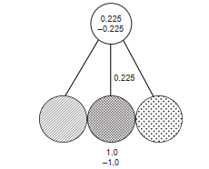
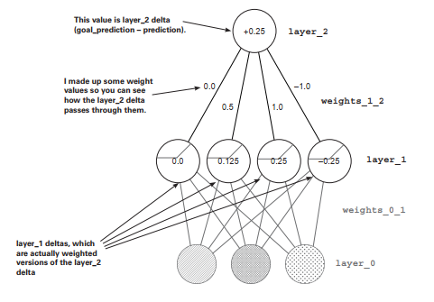

# Lab : Building your first deep neural network: introduction to backpropagation

#### Pre-reqs:
- Google Chrome (Recommended)

#### Lab Environment
Notebooks are ready to run. All packages have been installed. There is no requirement for any setup.

**Note:** Elev8ed Notebooks (powered by Jupyter) will be accessible at the port given to you by your instructor. Password for jupyterLab : `1234`

All Notebooks are present in `work/Grokking-Deep-Learning` folder. To copy and paste: use **Control-C** and to paste inside of a terminal, use **Control-V**

You can access jupyter lab at `<host-ip>:<port>/lab/workspaces/lab4_Backpropagation`


## The streetlight problem
This toy problem considers how a network learns entire datasets.

Consider yourself approaching a street corner in a foreign country. As you approach, you
look up and realize that the street light is unfamiliar. How can you know when it’s safe to
cross the street?

 

You can know when it’s safe to cross the street by interpreting the streetlight. But in this
case, you don’t know how to interpret it. Which light combinations indicate when it’s time
to walk? Which indicate when it’s time to stop? To solve this problem, you might sit at the
street corner for a few minutes observing the correlation between each light combination
and whether people around you choose to walk or stop. You take a seat and record the
following pattern:


OK, nobody walked at the first light. At this point you’re thinking, "Wow, this pattern could
be anything. The left light or the right light could be correlated with stopping, or the central
light could be correlated with walking." There’s no way to know. Let’s take another datapoint:


People walked, so something about this light changed the signal. The only thing you know
for sure is that the far-right light doesn’t seem to indicate one way or another. Perhaps it’s
irrelevant. Let’s collect another datapoint:


Now you’re getting somewhere. Only the middle light changed this time, and you got the
opposite pattern. The working hypothesis is that the middle light indicates when people feel
safe to walk. Over the next few minutes, you record the following six light patterns, noting
when people walk or stop. Do you notice a pattern overall?


As hypothesized, there is a perfect correlation between the middle (crisscross) light and
whether it’s safe to walk. You learned this pattern by observing all the individual datapoints
and searching for correlation. This is what you’re going to train a neural network to do.


<span style="color:red;">Preparing the data </span>
Neural networks don’t read streetlights.

In the previous labs, you learned about supervised algorithms. You learned that they
can take one dataset and turn it into another. More important, they can take a dataset of
what you know and turn it into a dataset of what you want to know.

How do you train a supervised neural network? You present it with two datasets and ask it
to learn how to transform one into the other. Think back to the streetlight problem. Can you
identify two datasets? Which one do you always know? Which one do you want to know?

You do indeed have two datasets. On the one hand, you have six streetlight states. On the
other hand, you have six observations of whether people walked. These are the two datasets.

You can train the neural network to convert from the dataset you know to the dataset that
you want to know. In this particular real-world example, you know the state of the streetlight
at any given time, and you want to know whether it’s safe to cross the street.


To prepare this data for the neural network, you need to first split it into these two groups
(what you know and what you want to know). Note that you could attempt to go backward
if you swapped which dataset was in which group. For some problems, this works.

## Matrices and the matrix relationship
Translate the streetlight into math.

Math doesn’t understand streetlights. As mentioned in the previous section, you want to
teach a neural network to translate a streetlight pattern into the correct stop/walk pattern.
The operative word here is pattern. What you really want to do is mimic the pattern of the
streetlight in the form of numbers. Let me show you what I mean.


Notice that the pattern of numbers shown here mimics the pattern from the streetlights in
the form of 1s and 0s. Each light gets a column (three columns total, because there are three
lights). Notice also that there are six rows representing the six different observed streetlights.

This structure of 1s and 0s is called a matrix. This relationship between the rows and
columns is common in matrices, especially matrices of data (like the streetlights).

In data matrices, it’s convention to give each recorded example a single row. It’s also
convention to give each thing being recorded a single column. This makes the matrix easy
to read.

So, a column contains every state in which a thing was recorded. In this case, a column
contains every on/off state recorded for a particular light. Each row contains the
simultaneous state of every light at a particular moment in time. Again, this is common.


## Good data matrices perfectly mimic the outside world.
The data matrix doesn’t have to be all 1s and 0s. What if the streetlights were on dimmers
and turned on and off at varying degrees of intensity? Perhaps the streetlight matrix would
look more like this:
Streetlights


Matrix A is perfectly valid. It’s mimicking the patterns that exist in the real world
(streetlight), so you can ask the computer to interpret them. Would the following matrix
still be valid?


Matrix (B) is valid. It adequately captures the relationships between various training
examples (rows) and lights (columns). Note that Matrix A * 10 == Matrix B
(A * 10 == B). This means these matrices are scalar multiples of each other.


## Matrices A and B both contain the same underlying pattern.
The important takeaway is that an infinite number of matrices exist that perfectly reflect the
streetlight patterns in the dataset. Even the one shown next is perfect.


It’s important to recognize that the underlying pattern isn’t the same as the matrix. It’s a
property of the matrix. In fact, it’s a property of all three of these matrices (A, B, and C).
The pattern is what each of these matrices is expressing. The pattern also existed in the
streetlights.

This input data pattern is what you want the neural network
to learn to transform into the output data pattern. But in order
to learn the output data pattern, you also need to capture the
pattern in the form of a matrix, as shown here.


Note that you could reverse the 1s and 0s, and the output matrix
would still capture the underlying STOP/WALK pattern that’s
present in the data. You know this because regardless of whether
you assign a 1 to WALK or to STOP, you can still decode the 1s
and 0s into the underlying STOP/WALK pattern.

The resulting matrix is called a lossless representation because
you can perfectly convert back and forth between your stop/
walk notes and the matrix.

## Creating a matrix or two in Python
Import the matrices into Python.

You’ve converted the streetlight pattern into a matrix (one with just 1s and 0s). Now let’s
create that matrix (and, more important, its underlying pattern) in Python so the neural
network can read it. Python’s NumPy library (introduced in chapter 3) was built just for
handling matrices. Let’s see it in action:

```
import numpy as np
streetlights = np.array( [ [ 1, 0, 1 ],
								
[ 0, 1, 1 ],
								
[ 0, 0, 1 ],
								
[ 1, 1, 1 ],
								
[ 0, 1, 1 ],
								
[ 1, 0, 1 ] ] )
```

If you’re a regular Python user, something should be striking in this code. A matrix is just
a list of lists. It’s an array of arrays. What is NumPy? NumPy is really just a fancy wrapper
for an array of arrays that provides special, matrix-oriented functions. Let’s create a NumPy
matrix for the output data, too:

```
walk _ vs _ stop = np.array(
								
								
								
								
								

[
[
[
[
[
[

[
1
0
1
1
0

0 ],
],
],
],
],
] ] )
```

What do you want the neural network to do? Take the streetlights matrix and learn to
transform it into the walk_vs_stop matrix. More important, you want the neural network
to take any matrix containing the same underlying pattern as streetlights and transform it
into a matrix that contains the underlying pattern of walk_vs_stop. More on that later. Let’s
start by trying to transform streetlights into walk_vs_stop using a neural network.
Neural network


<span style="color:red;">Building a neural network </span>

You’ve been learning about neural networks for several chapters now. You have a new
dataset, and you’re going to create a neural network to solve it. Following is some example
code to learn the first streetlight pattern. This should look familiar:


```
for iteration in range(20):
prediction = input.dot(weights)
error = (goal_prediction - prediction) ** 2
delta = prediction - goal_prediction
weights = weights - (alpha * (input * delta))	
print("Error:" + str(error) + " Prediction:" + str(prediction))
```

This code example may bring back several nuances you learned in chapter 3. First, the
use of the dot function was a way to perform a dot product (weighted sum) between
two vectors. But not included in chapter 3 was the way NumPy matrices can perform
elementwise addition and multiplication:


NumPy makes these operations easy. When you put a + between two vectors, it does what
you expect: it adds the two vectors together. Other than these nice NumPy operators and
the new dataset, the neural network shown here is the same as the ones built previously.


## Learning the whole dataset
The neural network has been learning only one streetlight. Don’t
we want it to learn them all?

So far in this book, you’ve trained neural networks that learned how to model a single
training example (input -> goal_pred pair). But now you’re trying to build a neural
network that tells you whether it’s safe to cross the street. You need it to know more than one
streetlight. How do you do this? You train it on all the streetlights at once:


## Full, batch, and stochastic gradient descent
Stochastic gradient descent updates weights one example
at a time.

As it turns out, this idea of learning one example at a time is a variant on gradient descent
called stochastic gradient descent, and it’s one of the handful of methods that can be used to
learn an entire dataset.

How does stochastic gradient descent work? As you saw in the previous example, it
performs a prediction and weight update for each training example separately. In other
words, it takes the first streetlight, tries to predict it, calculates the weight_delta, and
updates the weights. Then it moves on to the second streetlight, and so on. It iterates
through the entire dataset many times until it can find a weight configuration that works
well for all the training examples.

**(Full) gradient descent updates weights one dataset at a time.**

As introduced in chapter 4, another method for learning an entire dataset is gradient
descent (or average/full gradient descent). Instead of updating the weights once for each
training example, the network calculates the average weight_delta over the entire dataset,
changing the weights only each time it computes a full average.

**Batch gradient descent updates weights after n examples.** 

This will be covered in more detail later, but there’s also a third configuration that sort
of splits the difference between stochastic gradient descent and full gradient descent.
Instead of updating the weights after just one example or after the entire dataset of
examples, you choose a batch size (typically between 8 and 256) of examples, after
which the weights are updated.

We’ll discuss this more later in the book, but for now, recognize that the previous
example created a neural network that can learn the entire streetlights dataset by
training on each example, one at a time.

## Neural networks learn correlation
What did the last neural network learn?

You just got done training a single-layer neural network to take a streetlight pattern and
identify whether it was safe to cross the street. Let’s take on the neural network’s perspective
for a moment. The neural network doesn’t know that it was processing streetlight data. All it
was trying to do was identify which input (of the three possible) correlated with the output.
It correctly identified the middle light by analyzing the final weight positions of the network.


Notice that the middle weight is very near 1, whereas the far-left and far-right weights are
very near 0. At a high level, all the iterative, complex processes for learning accomplished
something rather simple: the network identified correlation between the middle input and
output. The correlation is located wherever the weights were set to high numbers. Inversely,
randomness with respect to the output was found at the far-left and far-right weights (where
the weight values are very near 0).

How did the network identify correlation? Well, in the process of gradient descent, each
training example asserts either up pressure or down pressure on the weights. On average,
there was more up pressure for the middle weight and more down pressure for the other
weights. Where does the pressure come from? Why is it different for different weights?


## Up and down pressure
It comes from the data.

Each node is individually trying to correctly predict the output given the input. For the
most part, each node ignores all the other nodes when attempting to do so. The only cross
communication occurs in that all three weights must share the same error measure. The
weight update is nothing more than taking this shared error measure and multiplying it by
each respective input.

Why do you do this? A key part of why neural networks learn is error attribution, which
means given a shared error, the network needs to figure out which weights contributed (so
they can be adjusted) and which weights did not contribute (so they can be left alone).
Training data


Consider the first training example. Because the middle input is 0, the middle weight
is completely irrelevant for this prediction. No matter what the weight is, it’s going to be
multiplied by 0 (the input). Thus, any error at that training example (regardless of whether
it’s too high or too low), can be attributed to only the far-left and right weights.

Consider the pressure of this first training example. If the network should predict 0, and two
inputs are 1s, then this will cause error, which drives the weight values toward 0.

The Weight Pressure table helps describe the effect of each training example on each
respective weight. + indicates that it has pressure toward 1, and – indicates that it has
pressure toward 0. Zeros (0) indicate that there is no pressure because the input datapoint
is 0, so that weight won’t be changed. Notice that the far-left weight has two negatives and
one positive, so on average the weight will move toward 0. The middle weight has three
positives, so on average the weight will move toward 1.


Each individual weight is attempting to compensate for error. In the first training example,
there’s discorrelation between the far-right and far-left inputs and the desired output. This
causes those weights to experience down pressure.

This same phenomenon occurs throughout all six training examples, rewarding correlation
with pressure toward 1 and penalizing decorrelation with pressure toward 0. On average,
this causes the network to find the correlation present between the middle weight and the
output to be the dominant predictive force (heaviest weight in the weighted average of the
input), making the network quite accurate.

**Bottom line**
The prediction is a weighted sum of the inputs. The learning algorithm rewards inputs that
correlate with the output with upward pressure (toward 1) on their weight while penalizing
inputs with discorrelation with downward pressure. The weighted sum of the inputs find
perfect correlation between the input and the output by weighting decorrelated inputs to 0.

The mathematician in you may be cringing a little. Upward pressure and downward pressure
are hardly precise mathematical expressions, and they have plenty of edge cases where
this logic doesn’t hold (which we’ll address in a second). But you’ll later find that this is an
extremely valuable approximation, allowing you to temporarily overlook all the complexity
of gradient descent and just remember that learning rewards correlation with larger weights
(or more generally, learning finds correlation between the two datasets).


## Edge case: Overfitting
Sometimes correlation happens accidentally.

Consider again the first example in the training data. What if the far-left weight was 0.5 and
the far-right weight was –0.5? Their prediction would equal 0. The network would predict
perfectly. But it hasn’t remotely learned how to safely predict streetlights (those weights
would fail in the real world). This phenomenon is known as overfitting.

**Deep learning’s greatest weakness: Overfitting** 

Error is shared among all the weights. If a particular configuration of weights accidentally
creates perfect correlation between the prediction and the output dataset (such that
error == 0) without giving the heaviest weight to the best inputs, the neural network
will stop learning.

If it wasn’t for the other training examples, this fatal flaw would cripple the neural network.
What do the other training examples do? Well, let’s look at the second training example. It
bumps the far-right weight upward while not changing the far-left weight. This throws off
the equilibrium that stopped the learning in the first example. As long as you don’t train
exclusively on the first example, the rest of the training examples will help the network avoid
getting stuck in these edge-case configurations that exist for any one training example.

This is very important. Neural networks are so flexible that they can find many, many
different weight configurations that will correctly predict for a subset of training data. If
you trained this neural network on the first two training examples, it would likely stop
learning at a point where it did not work well for the other training examples. In essence, it
memorized the two training examples instead of finding the correlation that will generalize
to any possible streetlight configuration.

If you train on only two streetlights and the network finds just these edge-case
configurations, it could fail to tell you whether it’s safe to cross the street when it sees a
streetlight that wasn’t in the training data.

**Key takeaway**
The greatest challenge you’ll face with deep learning is convincing your neural network to
generalize instead of just memorize. You’ll see this again.

## Edge case: Conflicting pressure
Sometimes correlation fights itself.

Consider the far-right column in the following Weight Pressure table. What do you see?

This column seems to have an equal number of upward and downward pressure moments.
But the network correctly pushes this (far-right) weight down to 0, which means the
downward pressure moments must be larger than the upward ones. How does this work?


The left and middle weights have enough signal to converge on their own. The left weight
falls to 0, and the middle weight moves toward 1. As the middle weight moves higher and
higher, the error for positive examples continues to decrease. But as they approach their
optimal positions, the decorrelation on the far-right weight becomes more apparent.

Let’s consider the extreme example, where the left and middle weights are perfectly set to
0 and 1, respectively. What happens to the network? If the right weight is above 0, then the
network predicts too high; and if the right weight is beneath 0, the network predicts too low.

As other nodes learn, they absorb some of the error; they absorb part of the correlation.
They cause the network to predict with moderate correlative power, which reduces the error.
The other weights then only try to adjust their weights to correctly predict what’s left.

In this case, because the middle weight has consistent signal to absorb all the correlation
(because of the 1:1 relationship between the middle input and the output), the error when
you want to predict 1 becomes very small, but the error to predict 0 becomes large, pushing
the middle weight downward.

## It doesn’t always work out like this.

In some ways, you kind of got lucky. If the middle node hadn’t been so perfectly correlated,
the network might have struggled to silence the far-right weight. Later you’ll learn about
regularization, which forces weights with conflicting pressure to move toward 0.

As a preview, regularization is advantageous because if a weight has equal pressure upward
and downward, it isn’t good for anything. It’s not helping either direction. In essence,
regularization aims to say that only weights with really strong correlation can stay on;
everything else should be silenced because it’s contributing noise. It’s sort of like natural
selection, and as a side effect it would cause the neural network to train faster (fewer
iterations) because the far-right weight has this problem of both positive and negative
pressure.

In this case, because the far-right node isn’t definitively correlative, the network would
immediately start driving it toward 0. Without regularization (as you trained it before), you
won’t end up learning that the far-right input is useless until after the left and middle start to
figure out their patterns. More on this later.

If networks look for correlation between an input column of data and the output column,
what would the neural network do with the following dataset?


There is no correlation between any input column and the output column. Every weight has
an equal amount of upward pressure and downward pressure. This dataset is a real problem
for the neural network.

Previously, you could solve for input datapoints that had both upward and downward
pressure because other nodes would start solving for either the positive or negative
predictions, drawing the balanced node to favor up or down. But in this case, all the inputs
are equally balanced between positive and negative pressure. What do you do?


<span style="color:red;"> Learning indirect correlation</span>
If your data doesn’t have correlation, create intermediate data
that does!

Previously, I described a neural network as an instrument that searches for correlation
between input and output datasets. I want to refine this just a touch. In reality, neural
networks search for correlation between their input and output layers.

You set the values of the input layer to be individual rows of the input data, and you try
to train the network so that the output layer equals the output dataset. Oddly enough, the
neural network doesn’t know about data. It just searches for correlation between the input
and output layers.


Unfortunately, this is a new streetlights dataset that has no correlation between the input
and output. The solution is simple: use two of these networks. The first one will create an
intermediate dataset that has limited correlation with the output, and the second will use
that limited correlation to correctly predict the output.

Because the input dataset doesn’t correlate with the output dataset, you’ll use the input
dataset to create an intermediate dataset that does have correlation with the output. It’s kind
of like cheating.


## Creating correlation

Here’s a picture of the new neural network. You basically stack two neural networks on top
of each other. The middle layer of nodes (layer_1) represents the intermediate dataset. The
goal is to train this network so that even though there’s no correlation between the input
dataset and output dataset (layer_0 and layer_2), the layer_1 dataset that you create
using layer_0 will have correlation with layer_2.


Note: this network is still just a function. It has a bunch of weights that are collected together
in a particular way. Furthermore, gradient descent still works because you can calculate how
much each weight contributes to the error and adjust it to reduce the error to 0. And that’s
exactly what you’re going to do.


## Stacking neural networks:
A review briefly mentioned stacked neural networks.
Let’s review.

When you look at the following architecture, the prediction occurs exactly as you might
expect when I say, "Stack neural networks." The output of the first lower network (layer_0
to layer_1) is the input to the second upper neural network (layer_1 to layer_2). The
prediction for each of these networks is identical to what you saw before.
walk/stop


As you start to think about how this neural network learns, you already know a great deal.
If you ignore the lower weights and consider their output to be the training set, the top
half of the neural network (layer_1 to layer_2) is just like the networks trained in the
preceding chapter. You can use all the same learning logic to help them learn.

The part that you don’t yet understand is how to update the weights between layer_0
and layer_1. What do they use as their error measure? As you may remember from
chapter 5, the cached/normalized error measure is called delta. In this case, you want
to figure out how to know the delta values at layer_1 so they can help layer_2 make
accurate predictions.


## Backpropagation: Long-distance error attribution
The weighted average error

What’s the prediction from layer_1 to layer_2? It’s a weighted average of the values at
layer_1. If layer_2 is too high by x amount, how do you know which values at layer_1
contributed to the error? The ones with higher weights (weights_1_2) contributed more.
The ones with lower weights from layer_1 to layer_2 contributed less.

Consider the extreme. Let’s say the far-left weight from layer_1 to layer_2 was zero. How
much did that node at layer_1 cause the network’s error? Zero.

It’s so simple it’s almost hilarious. The weights from layer_1 to layer_2 exactly describe how
much each layer_1 node contributes to the layer_2 prediction. This means those weights
also exactly describe how much each layer_1 node contributes to the layer_2 error.

How do you use the delta at layer_2 to figure out the delta at layer_1? You multiply it
by each of the respective weights for layer_1. It’s like the prediction logic in reverse. This
process of moving delta signal around is called backpropagation.
This value is the layer_2 delta


<span style="color:red;">Backpropagation: Why does this work?</span>
The weighted average delta

In the neural network from chapter 5, the delta variable told you the direction and
amount the value of this node should change next time. All backpropagation lets you
do is say, "Hey, if you want this node to be x amount higher, then each of these previous
four nodes needs to be x*weights_1_2 amount higher/lower, because these weights were
amplifying the prediction by weights_1_2 times."

When used in reverse, the weights_1_2 matrix amplifies the error by the appropriate
amount. It amplifies the error so you know how much each layer_1 node should move
up or down.

Once you know this, you can update each weight matrix as you did before. For each
weight, multiply its output delta by its input value, and adjust the weight by that much
(or you can scale it with alpha).


## Linear vs. nonlinear
This is probably the hardest concept in the book.
Let’s take it slowly.

I’m going to show you a phenomenon. As it turns out, you need one more piece to make this
neural network train. Let’s take it from two perspectives. The first will show why the neural
network can’t train without it. In other words, first I’ll show you why the neural network
is currently broken. Then, once you add this piece, I’ll show you what it does to fix this
problem. For now, check out this simple algebra:

```
1 * 10 * 2 = 100
5 * 20 = 100

1 * 0.25 * 0.9 = 0.225
1 * 0.225 = 0.225
```

Here’s the takeaway: for any two multiplications, I can accomplish the same thing using a
single multiplication. As it turns out, this is bad. Check out the following:




These two graphs show two training examples
each, one where the input is 1.0 and another
where the input is –1.0. The bottom line: for
any three-layer network you create, there’s a
two-layer network that has identical behavior.
Stacking two neural nets (as you know them at
the moment) doesn’t give you any more power.
Two consecutive weighted sums is just a more
expensive version of one weighted sum.


## Why the neural network still doesn’t work
If you trained the three-layer network as it is now,
it wouldn’t converge. \

**Problem**: For any two consecutive weighted sums of the input, there exists a single
weighted sum with exactly identical behavior. Anything that the three-layer network can
do, the two-layer network can also do.

Let’s talk about the middle layer (layer_1) before it’s fixed. Right now, each node (out of the
four) has a weight coming to it from each of the inputs. Let’s think about this from a correlation
standpoint. Each node in the middle layer subscribes to a certain amount of correlation with
each input node. If the weight from an input to the middle layer is 1.0, then it subscribes to
exactly 100% of that node’s movement. If that node goes up by 0.3, the middle node will follow.
If the weight connecting two nodes is 0.5,
each node in the middle layer subscribes to
exactly 50% of that node’s movement.

The only way the middle node can escape
the correlation of one particular input node
is if it subscribes to additional correlation
from another input node. Nothing new is
being contributed to this neural network.
Each hidden node subscribes to a little
correlation from the input nodes.

The middle nodes don’t get to add anything
to the conversation; they don’t get to have
correlation of their own. They’re more or
less correlated to various input nodes.


But because you know that in the new
dataset there is no correlation between any of the inputs and the output, how can the middle
layer help? It mixes up a bunch of correlation that’s already useless. What you really need is
for the middle layer to be able to selectively correlate with the input.

You want the middle layer to sometimes correlate with an input, and sometimes not correlate.
That gives it correlation of its own. This gives the middle layer the opportunity to not just
always be x% correlated to one input and y% correlated to another input. Instead, it can be
x% correlated to one input only when it wants to be, but other times not be correlated at all.
This is called conditional correlation or sometimes correlation.


## The secret to sometimes correlation
Turn off the node when the value would be below 0.

This might seem too simple to work, but consider this: if a node’s value dropped below 0,
normally the node would still have the same correlation to the input as always. It would just
happen to be negative in value. But if you turn off the node (setting it to 0) when it would be
negative, then it has zero correlation to any inputs whenever it’s negative.

What does this mean? The node can now selectively pick and choose when it wants to be
correlated to something. This allows it to say something like, "Make me perfectly correlated
to the left input, but only when the right input is turned off." How can it do this? Well, if
the weight from the left input is 1.0 and the weight from the right input is a huge negative
number, then turning on both the left and right inputs will cause the node to be 0 all the
time. But if only the left input is on, the node will take on the value of the left input.

This wasn’t possible before. Earlier, the middle node was either always correlated to an input
or always not correlated. Now it can be conditional. Now it can speak for itself.

**Solution**: By turning off any middle node whenever it would be negative, you allow the
network to sometimes subscribe to correlation from various inputs. This is impossible for
two-layer neural networks, thus adding power to three-layer nets.

The fancy term for this "if the node would be negative, set it to 0" logic is nonlinearity.
Without this tweak, the neural network is linear. Without this technique, the output layer
only gets to pick from the same correlation it had in the two-layer network. It’s subscribing
to pieces of the input layer, which means it can’t solve the new streetlights dataset.

There are many kinds of nonlinearities. But the one discussed here is, in many cases, the best
one to use. It’s also the simplest. (It’s called relu.)

For what it’s worth, most other books and courses say that consecutive matrix multiplication
is a linear transformation. I find this unintuitive. It also makes it harder to understand
what nonlinearities contribute and why you choose one over the other (which we’ll get to
later). It says, "Without the nonlinearity, two matrix multiplications might as well be 1." My
explanation, although not the most concise answer, is an intuitive explanation of why you
need nonlinearities.


<span style="color:red;">A quick break </span>
That last part probably felt a little abstract, and that’s totally OK.

Here’s the deal. Previous chapters worked with simple algebra, so everything was ultimately
grounded in fundamentally simple tools. This lab started building on the premises you
learned earlier. Previously, you learned lessons like this:

You can compute the relationship between the error and any one of the weights so that you
know how changing the weight changes the error. You can then use this to reduce the error
to 0.

That was a massive lesson. But now we’re moving past it. Because we already worked through
why that works, you can take the statement at face value. The next big lesson came at the
beginning of this lab:

Adjusting the weights to reduce the error over a series of training examples ultimately
searches for correlation between the input and the output layers. If no correlation exists, then
the error will never reach 0.

This is an even bigger lesson. It largely means you can put the previous lesson out of
your mind for now. You don’t need it. Now you’re focused on correlation. The takeaway
is that you can’t constantly think about everything all at once. Take each lesson and let
yourself trust it. When it’s a more concise summarization (a higher abstraction) of more
granular lessons, you can set aside the granular and focus on understanding the higher
summarizations.

This is akin to a professional swimmer, biker, or similar athlete who requires a combined
fluid knowledge of a bunch of small lessons. A baseball player who swings a bat learned
thousands of little lessons to ultimately culminate in a great bat swing. But the player doesn’t
think of all of them when he goes to the plate. His actions are fluid—even subconscious. It’s
the same for studying these math concepts.

Neural networks look for correlation between input and output, and you no longer have to
worry about how that happens. You just know it does. Now we’re building on that idea. Let
yourself relax and trust the things you’ve already learned.

## Your first deep neural network
Here’s how to make the prediction.
The following code initializes the weights and makes a forward propagation. New code is bold.


For each piece of the code, follow along with
the figure. Input data comes into layer_0.
Via the dot function, the signal travels
up the weights from layer_0 to layer_1
(performing a weighted sum at each of the
four layer_1 nodes). These weighted sums
at layer_1 are then passed through the
relu function, which converts all negative
numbers to 0. Then a final weighted sum is
performed into the final node, layer_2.


## Backpropagation in code
You can learn the amount that each weight contributes
to the final error.

At the end of the previous chapter, I made an assertion that it would be important to
memorize the two-layer neural network code so you could quickly and easily recall it when I
reference more-advanced concepts. This is when that memorization matters.

The following listing is the new learning code, and it’s essential that you recognize and
understand the parts addressed in the previous chapters. If you get lost, go to chapter 5,
memorize the code, and then come back. It will make a big difference someday.


Believe it or not, the only truly new code is in bold. Everything else is fundamentally the
same as in previous pages. The relu2deriv function returns 1 when output > 0; otherwise,
it returns 0. This is the slope (the derivative) of the relu function. It serves an important
purpose, as you’ll see in a moment.


Remember, the goal is error attribution. It’s about figuring out how much each weight
contributed to the final error. In the first (two-layer) neural network, you calculated a delta
variable, which told you how much higher or lower you wanted the output prediction to
be. Look at the code here. You compute the layer_2_delta in the same way. Nothing new.
(Again, go back to chapter 5 if you’ve forgotten how that part works.)

Now that you know how much the final prediction should move up or down (delta), you
need to figure out how much each middle (layer_1) node should move up or down. These
are effectively intermediate predictions. Once you have the delta at layer_1, you can use
the same processes as before for calculating a weight update (for each weight, multiply its
input value by its output delta and increase the weight value by that much).

How do you calculate the deltas for layer_1? First, do the obvious: multiply the output
delta by each weight attached to it. This gives a weighting of how much each weight
contributed to that error. There’s one more thing to factor in. If relu set the output to a
layer_1 node to be 0, then it didn’t contribute to the error. When this is true, you should
also set the delta of that node to 0. Multiplying each layer_1 node by the relu2deriv
function accomplishes this. relu2deriv is either 1 or 0, depending on whether the layer_1
value is greater than 0.




As you can see, backpropagation is about calculating deltas for intermediate layers so you
can perform gradient descent. To do so, you take the weighted average delta on layer_2
for layer_1 (weighted by the weights in between them). You then turn off (set to 0) nodes
that weren’t participating in the forward prediction, because they couldn’t have contributed
to the error.


## Putting it all together
Here’s the self-sufficient program you should be able to run
(runtime output follows).


```
Error:0.634231159844
Error:0.358384076763
Error:0.0830183113303
Error:0.0064670549571
Error:0.000329266900075
Error:1.50556226651e-05
```

## Why do deep networks matter?
What’s the point of creating "intermediate datasets" that
have correlation?

Consider the cat picture shown here. Consider further that I had a dataset of images with
cats and without cats (and I labeled them as such). If I wanted to train a neural network to
take the pixel values and predict whether there’s a cat in the picture, the two-layer network
might have a problem.

Just as in the last streetlight dataset, no individual pixel correlates with whether there’s a cat
in the picture. Only different configurations of pixels correlate with whether there’s a cat.


This is the essence of deep learning. Deep learning is all about creating intermediate layers
(datasets) wherein each node in an intermediate layer represents the presence or absence of
a different configuration of inputs.

This way, for the cat images dataset, no individual pixel has to correlate with whether there’s
a cat in the photo. Instead, the middle layer will attempt to identify different configurations
of pixels that may or may not correlate with a cat (such as an ear, or cat eyes, or cat hair).
The presence of many cat-like configurations will then give the final layer the information
(correlation) it needs to correctly predict the presence or absence of a cat.

Believe it or not, you can take the three-layer network and continue to stack more and
more layers. Some neural networks have hundreds of layers, each node playing its part in
detecting different configurations of input data. The rest of this book will be dedicated to
studying different phenomena within these layers in an effort to explore the full power of
deep neural networks.

Toward that end, I must issue the same challenge I did in chapter 5: memorize the previous
code. You’ll need to be very familiar with each of the operations in the code in order for the
following chapters to be readable. Don’t progress past this point until you can build a threelayer neural network from memory!
