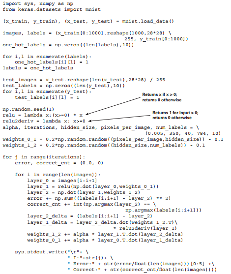
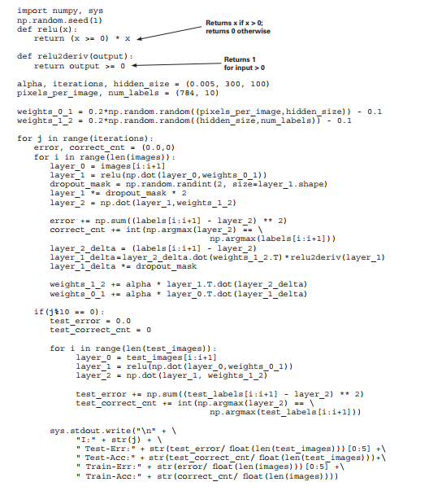
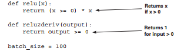

# Lab : Learning signal and ignoring noise: introduction to regularization and batching

#### Pre-reqs:
- Google Chrome (Recommended)

#### Lab Environment
Notebooks are ready to run. All packages have been installed. There is no requirement for any setup.

**Note:** Elev8ed Notebooks (powered by Jupyter) will be accessible at the port given to you by your instructor. Password for jupyterLab : `1234`

All Notebooks are present in `work/Grokking-Deep-Learning` folder. To copy and paste: use **Control-C** and to paste inside of a terminal, use **Control-V**

You can access jupyter lab at `<host-ip>:<port>/lab/workspaces/lab5_Regularization`

##### Run Notebook
Click notebook `Chapter8 - Intro to Regularization - Learning Signal and Ignoring Noise- Practice.ipynb` in jupterLab UI and run jupyter notebook. 
There are some placeholder(s) to write code in the notebook. You can get help from solution notebook `Chapter8 - Intro to Regularization - Learning Signal and Ignoring Noise.ipynb` as well as lab guide.

<h4><span style="color:red;"> Three-layer network on MNIST</span></h4>

Let’s return to the MNIST dataset and attempt to classify it with
the new network.

In last several chapters, you’ve learned that neural networks model correlation. The hidden
layers (the middle one in the three-layer network) can even create intermediate correlation
to help solve for a task (seemingly out of midair). How do you know the network is creating
good correlation?

When we discussed stochastic gradient descent with multiple inputs, we ran an experiment
where we froze one weight and then asked the network to continue training. As it was
training, the dots found the bottom of the bowls, as it were. You saw the weights become
adjusted to minimize the error.

When we froze the weight, the frozen weight still found the bottom of the bowl. For some
reason, the bowl moved so that the frozen weight value became optimal. Furthermore, if we
unfroze the weight to do some more training, it wouldn’t learn. Why? Well, the error had
already fallen to 0. As far as the network was concerned, there was nothing more to learn.

This begs the question, what if the input to the frozen weight was important to predicting
baseball victory in the real world? What if the network had figured out a way to accurately
predict the games in the training dataset (because that’s what networks do: they minimize
error), but it somehow forgot to include a valuable input?

Unfortunately, this phenomenon—overfitting—is extremely common in neural networks.
We could say it’s the archnemesis of neural networks; and the more powerful the neural
network’s expressive power (more layers and weights), the more prone the network is to
overfit. An everlasting battle is going on in research, where people continually find tasks
that need more powerful layers but then have to do lots of problem-solving to make sure the
network doesn’t overfit.

In this lab, we’re going to study the basics of regularization, which is key to combatting
overfitting in neural networks. To do this, we’ll start with the most powerful neural network
(three-layer network with relu hidden layer) on the most challenging task (MNIST digit
classification).

To begin, go ahead and train the network, as shown next. You should see the same results
as those listed. Alas, the network learned to perfectly predict the training data. Should
we celebrate?





```
....
I:349 Error:0.108 Correct:1.0
```


## Well, that was easy
The neural network perfectly learned to predict all 1,000 images.

In some ways, this is a real victory. The neural network was able to take a dataset of 1,000
images and learn to correlate each input image with the correct label.
How did it do this? It iterated through each image, made a prediction, and then updated
each weight ever so slightly so the prediction was better next time. Doing this long enough
on all the images eventually reached a state where the network could correctly predict on all
the images.

Here’s a non-obvious question: how well will the neural network do on an image it hasn’t
seen before? In other words, how well will it do on an image that wasn’t part of the 1,000
images it was trained on? The MNIST dataset has many more images than just the 1,000 you
trained on; let’s try it.

In the notebook from the previous code are two variables: test_images and test_labels.
If you execute the following code, it will run the neural network on these images and
evaluate how well the network classifies them:

```
if(j % 10 == 0 or j == iterations-1):
error, correct_cnt = (0.0, 0)
for i in range(len(test_images)):
layer_0 = test_images[i:i+1]
layer_1 = relu(np.dot(layer_0,weights_0_1))
layer_2 = np.dot(layer_1,weights_1_2)
error += np.sum((test_labels[i:i+1] - layer_2) ** 2)
correct_cnt += int(np.argmax(layer_2) == \
np.argmax(test_labels[i:i+1]))
sys.stdout.write(" Test-Err:" + str(error/float(len(test_images)))[0:5] +\
" Test-Acc:" + str(correct_cnt/float(len(test_images))))
print()

Error:0.653 Correct:0.7073
```

The network did horribly! It predicted with an accuracy of only 70.7%. Why does it do so
terribly on these new testing images when it learned to predict with 100% accuracy on the
training data? How strange.

This 70.7% number is called the test accuracy. It’s the accuracy of the neural network on
data the network was not trained on. This number is important because it simulates how
well the neural network will perform if you try to use it in the real world (which gives the
network only images it hasn’t seen before). This is the score that matters.

## Memorization vs. generalization
Memorizing 1,000 images is easier than generalizing to all images.

Let’s consider again how a neural network learns. It adjusts each weight in each matrix so
the network is better able to take specific inputs and make a specific prediction. Perhaps a
better question might be, "If we train it on 1,000 images, which it learns to predict perfectly,
why does it work on other images at all?"

As you might expect, when the fully trained neural network is applied to a new image,
it’s guaranteed to work well only if the new image is nearly identical to an image from the
training data. Why? Because the neural network learned to transform input data to output
data for only very specific input configurations. If you give it something that doesn’t look
familiar, it will predict randomly.

This makes neural networks kind of pointless. What’s the point of a neural network working only
on the data you trained it on? You already know the correct classifications for those datapoints.
Neural networks are useful only if they work on data you don’t already know the answer to.
As it turns out, there’s a way to combat this. Here I’ve printed out both the training and
testing accuracy of the neural network as it was training (every 10 iterations). Notice
anything interesting? You should see a clue to better networks:

```
I:0 Train-Err:0.722 Train-Acc:0.537 Test-Err:0.601 Test-Acc:0.6488
I:10 Train-Err:0.312 Train-Acc:0.901 Test-Err:0.420 Test-Acc:0.8114
I:20 Train-Err:0.260 Train-Acc:0.93 Test-Err:0.414 Test-Acc:0.8111
I:30 Train-Err:0.232 Train-Acc:0.946 Test-Err:0.417 Test-Acc:0.8066
I:40 Train-Err:0.215 Train-Acc:0.956 Test-Err:0.426 Test-Acc:0.8019
I:50 Train-Err:0.204 Train-Acc:0.966 Test-Err:0.437 Test-Acc:0.7982
I:60 Train-Err:0.194 Train-Acc:0.967 Test-Err:0.448 Test-Acc:0.7921
I:70 Train-Err:0.186 Train-Acc:0.975 Test-Err:0.458 Test-Acc:0.7864
I:80 Train-Err:0.179 Train-Acc:0.979 Test-Err:0.466 Test-Acc:0.7817
I:90 Train-Err:0.172 Train-Acc:0.981 Test-Err:0.474 Test-Acc:0.7758
I:100 Train-Err:0.166 Train-Acc:0.984 Test-Err:0.482 Test-Acc:0.7706
I:110 Train-Err:0.161 Train-Acc:0.984 Test-Err:0.489 Test-Acc:0.7686
I:120 Train-Err:0.157 Train-Acc:0.986 Test-Err:0.496 Test-Acc:0.766
I:130 Train-Err:0.153 Train-Acc:0.99 Test-Err:0.502 Test-Acc:0.7622
I:140 Train-Err:0.149 Train-Acc:0.991 Test-Err:0.508 Test-Acc:0.758
....
I:210 Train-Err:0.127 Train-Acc:0.998 Test-Err:0.544 Test-Acc:0.7446
I:220 Train-Err:0.125 Train-Acc:0.998 Test-Err:0.552 Test-Acc:0.7416
I:230 Train-Err:0.123 Train-Acc:0.998 Test-Err:0.560 Test-Acc:0.7372
I:240 Train-Err:0.121 Train-Acc:0.998 Test-Err:0.569 Test-Acc:0.7344
I:250 Train-Err:0.120 Train-Acc:0.999 Test-Err:0.577 Test-Acc:0.7316
I:260 Train-Err:0.118 Train-Acc:0.999 Test-Err:0.585 Test-Acc:0.729
I:270 Train-Err:0.117 Train-Acc:0.999 Test-Err:0.593 Test-Acc:0.7259
I:280 Train-Err:0.115 Train-Acc:0.999 Test-Err:0.600 Test-Acc:0.723
I:290 Train-Err:0.114 Train-Acc:0.999 Test-Err:0.607 Test-Acc:0.7196
I:300 Train-Err:0.113 Train-Acc:0.999 Test-Err:0.614 Test-Acc:0.7183
I:310 Train-Err:0.112 Train-Acc:0.999 Test-Err:0.622 Test-Acc:0.7165
I:320 Train-Err:0.111 Train-Acc:0.999 Test-Err:0.629 Test-Acc:0.7133
I:330 Train-Err:0.110 Train-Acc:0.999 Test-Err:0.637 Test-Acc:0.7125
I:340 Train-Err:0.109 Train-Acc:1.0 Test-Err:0.645 Test-Acc:0.71
I:349 Train-Err:0.108 Train-Acc:1.0 Test-Err:0.653 Test-Acc:0.7073
```

<h4><span style="color:red;"> Overfitting in neural networks</span></h4>

Neural networks can get worse if you train them too much!

For some reason, the test accuracy went up for the first 20 iterations and then slowly
decreased as the network trained more and more (during which time the training accuracy
was still improving). This is common in neural networks. Let me explain the phenomenon
via an analogy.

Imagine you’re creating a mold for a common dinner fork, but instead of using it to create
other forks, you want to use it to identify whether a particular utensil is a fork. If an object
fits in the mold, you’ll conclude that the object is a fork, and if it doesn’t, you’ll conclude that
it’s not a fork.

Let’s say you set out to make this mold, and you start with a wet piece of clay and a big
bucket of three-pronged forks, spoons, and knives. You then press each of the forks into
the same place in the mold to create an outline, which sort of looks like a mushy fork. You
repeatedly place all the forks in the clay over and over, hundreds of times. When you let the
clay dry, you then find that none of the spoons or knives fit into this mold, but all the forks
do. Awesome! You did it. You correctly made a mold that can fit only the shape of a fork.

But what happens if someone hands you a four-pronged fork? You look at your mold and
notice that there’s a specific outline for three thin prongs in the clay. The four-pronged fork
doesn’t fit. Why not? It’s still a fork.

It’s because the clay wasn’t molded on any four-pronged forks. It was molded only on the
three-pronged variety. In this way, the clay has overfit to recognize only the types of forks it
was "trained" to shape.

This is exactly the same phenomenon you just witnessed in the neural network. It’s an even
closer parallel than you might think. One way to view the weights of a neural network is
as a high-dimensional shape. As you train, this shape molds around the shape of the data,
learning to distinguish one pattern from another. Unfortunately, the images in the testing
dataset were slightly different from the patterns in the training dataset. This caused the
network to fail on many of the testing examples.

A more official definition of a neural network that overfits is a neural network that has
learned the noise in the dataset instead of making decisions based only on the true signal.


## Where overfitting comes from
What causes neural networks to overfit?

Let’s alter this scenario a bit. Picture the fresh clay again (unmolded). What if you pushed
only a single fork into it? Assuming the clay was very thick, it wouldn’t have as much detail
as the previous mold (which was imprinted many times). Thus, it would be only a very
general shape of a fork. This shape might be compatible with both the three- and fourpronged varieties of fork, because it’s still a fuzzy imprint.

Assuming this information, the mold got worse at the testing dataset as you imprinted more
forks because it learned more-detailed information about the training dataset it was being
molded to. This caused it to reject images that were even the slightest bit off from what it
had repeatedly seen in the training data.

What is this detailed information in the images that’s incompatible with the test data? In the
fork analogy, it’s the number of prongs on the fork. In images, it’s generally referred to as
noise. In reality, it’s a bit more nuanced. Consider these two dog pictures.


Everything that makes these pictures unique beyond what captures the essence of "dog"
is included in the term noise. In the picture on the left, the pillow and the background are
both noise. In the picture on the right, the empty, middle blackness of the dog is a form of
noise as well. It’s really the edges that tell you it’s a dog; the middle blackness doesn’t tell you
anything. In the picture on the left, the middle of the dog has the furry texture and color of a
dog, which could help the classifier correctly identify it.

How do you get neural networks to train only on the signal (the essence of a dog) and ignore
the noise (other stuff irrelevant to the classification)? One way is early stopping. It turns out
a large amount of noise comes in the fine-grained detail of an image, and most of the signal
(for objects) is found in the general shape and perhaps color of the image.

## The simplest regularization: Early stopping
Stop training the network when it starts getting worse.

How do you get a neural network to ignore the fine-grained detail and capture only the
general information present in the data (such as the general shape of a dog or of an MNIST
digit)? You don’t let the network train long enough to learn it.

In the fork-mold example, it takes many forks imprinted many times to create the perfect
outline of a three-pronged fork. The first few imprints generally capture only the shallow
outline of a fork. The same can be said for neural networks. As a result, early stopping is the
cheapest form of regularization, and if you’re in a pinch, it can be quite effective.

This brings us to the subject this lab is all about: regularization. Regularization is a
subfield of methods for getting a model to generalize to new datapoints (instead of just
memorizing the training data). It’s a subset of methods that help the neural network learn
the signal and ignore the noise. In this case, it’s a toolset at your disposal to create neural
networks that have these properties.

**Regularization**
Regularization is a subset of methods used to encourage generalization in learned
models, often by increasing the difficulty for a model to learn the fine-grained details of
training data.

The next question might be, how do you know when to stop? The only real way to know
is to run the model on data that isn’t in the training dataset. This is typically done using a
second test dataset called a validation set. In some circumstances, if you used the test set for
knowing when to stop, you could overfit to the test set. As a general rule, you don’t use it to
control training. You use a validation set instead.


<h4><span style="color:red;">Industry standard regularization: Dropout </span></h4>

The method: Randomly turn off neurons (set them to 0)
during training.

This regularization technique is as simple as it sounds. During training, you randomly
set neurons in the network to 0 (and usually the deltas on the same nodes during
backpropagation, but you technically don’t have to). This causes the neural network to train
exclusively using random subsections of the neural network.

Believe it or not, this regularization technique is generally accepted as the go-to, state-ofthe-art regularization technique for the vast majority of networks. Its methodology is simple
and inexpensive, although the intuitions behind why it works are a bit more complex.

**Why dropout works (perhaps oversimplified)**
Dropout makes a big network act like a little one by randomly training little subsections
of the network at a time, and little networks don’t overfit.

It turns out that the smaller a neural network is, the less it’s able to overfit. Why? Well, small
neural networks don’t have much expressive power. They can’t latch on to the more granular
details (noise) that tend to be the source of overfitting. They have room to capture only the
big, obvious, high-level features.

This notion of room or capacity is really important to keep in your mind. Think of it like
this. Remember the clay analogy? Imagine if the clay was made of sticky rocks the size of
dimes. Would that clay be able to make a good imprint of a fork? Of course not. Those
stones are much like the weights. They form around the data, capturing the patterns you’re
interested in. If you have only a few, larger stones, they can’t capture nuanced detail. Each
stone instead is pushed on by large parts of the fork, more or less averaging the shape
(ignoring fine creases and corners).

Now, imagine clay made of very fine-grained sand. It’s made up of millions and millions of
small stones that can fit into every nook and cranny of a fork. This is what gives big neural
networks the expressive power they often use to overfit to a dataset.

How do you get the power of a large neural network with the resistance to overfitting
of the small neural network? Take the big neural network and turn off nodes randomly.
What happens when you take a big neural network and use only a small part of it? It
behaves like a small neural network. But when you do this randomly over potentially
millions of different subnetworks, the sum total of the entire network still maintains its
expressive power. Neat, eh?


## Why dropout works: Ensembling works
Dropout is a form of training a bunch of networks and
averaging them.

Something to keep in mind: neural networks always start out randomly. Why does this
matter? Well, because neural networks learn by trial and error, this ultimately means
every neural network learns a little differently. It may learn equally effectively, but no two
neural networks are ever exactly the same (unless they start out exactly the same for some
random or intentional reason).

This has an interesting property. When you overfit two neural networks, no two neural
networks overfit in exactly the same way. Overfitting occurs only until every training
image can be predicted perfectly, at which point the error == 0 and the network stops
learning (even if you keep iterating). But because each neural network starts by predicting
randomly and then adjusting its weights to make better predictions, each network
inevitably makes different mistakes, resulting in different updates. This culminates in a
core concept:

Although it’s likely that large, unregularized neural networks will overfit to noise, it’s unlikely
they will overfit to the same noise.

Why don’t they overfit to the same noise? Because they start randomly, and they stop
training once they’ve learned enough noise to disambiguate between all the images in the
training set. The MNIST network needs to find only a handful of random pixels that happen
to correlate with the output labels, to overfit. But this is contrasted with, perhaps, an even
more important concept:

Neural networks, even though they’re randomly generated, still start by learning the biggest,
most broadly sweeping features before learning much about the noise.

The takeaway is this: if you train 100 neural networks (all initialized randomly), they will
each tend to latch onto different noise but similar broad signal. Thus, when they make
mistakes, they will often make differing mistakes. If you allowed them to vote equally, their
noise would tend to cancel out, revealing only what they all learned in common: the signal.


<h4><span style="color:red;">Dropout in code </span></h4>

Here’s how to use dropout in the real world.

In the MNIST classification model, let’s add dropout to the hidden layer, such that 50% of
the nodes are turned off (randomly) during training. You may be surprised that this is only
a three-line change in the code. Following is a familiar snippet from the previous neural
network logic, with the dropout mask added:

```
i = 0
layer_0 = images[i:i+1]
dropout_mask = np.random.randint(2,size=layer_1.shape)
layer_1 *= dropout_mask * 2
layer_2 = np.dot(layer_1, weights_1_2)
error += np.sum((labels[i:i+1] - layer_2) ** 2)
correct_cnt += int(np.argmax(layer_2) == \
						 np.argmax(labels[i+i+1]))
layer_2_delta = (labels[i:i+1] - layer_2)
layer_1_delta = layer_2_delta.dot(weights_1_2.T)\
						 * relu2deriv(layer_1)
layer_1_delta *= dropout_mask
weights_1_2 += alpha * layer_1.T.dot(layer_2_delta)
weights_0_1 += alpha * layer_0.T.dot(layer_1_delta)
```

To implement dropout on a layer (in this case, layer_1), multiply the layer_1 values by a
random matrix of 1s and 0s. This has the effect of randomly turning off nodes in layer_1
by setting them to equal 0. Note that dropout_mask uses what’s called a 50% Bernoulli
distribution such that 50% of the time, each value in dropout_mask is 1, and (1 – 50% =
50%) of the time, it’s 0.

This is followed by something that may seem a bit peculiar. You multiply layer_1 by 2.
Why do you do this? Remember that layer_2 will perform a weighted sum of layer_1.
Even though it’s weighted, it’s still a sum over the values of layer_1. If you turn off half the
nodes in layer_1, that sum will be cut in half. Thus, layer_2 would increase its sensitivity
to layer_1, kind of like a person leaning closer to a radio when the volume is too low to
better hear it. But at test time, when you no longer use dropout, the volume would be back
up to normal. This throws off layer_2’s ability to listen to layer_1. You need to counter this
by multiplying layer_1 by (1 / the percentage of turned on nodes). In this case, that’s 1/0.5,
which equals 2. This way, the volume of layer_1 is the same between training and testing,
despite dropout.




## Dropout evaluated on MNIST
If you remember from before, the neural network (without dropout) previously reached a
test accuracy of 81.14% before falling down to finish training at 70.73% accuracy. When you
add dropout, the neural network instead behaves this way:

```
I:0 Test-Err:0.641 Test-Acc:0.6333 Train-Err:0.891 Train-Acc:0.413
I:10 Test-Err:0.458 Test-Acc:0.787 Train-Err:0.472 Train-Acc:0.764
I:20 Test-Err:0.415 Test-Acc:0.8133 Train-Err:0.430 Train-Acc:0.809
I:30 Test-Err:0.421 Test-Acc:0.8114 Train-Err:0.415 Train-Acc:0.811
I:40 Test-Err:0.419 Test-Acc:0.8112 Train-Err:0.413 Train-Acc:0.827
I:50 Test-Err:0.409 Test-Acc:0.8133 Train-Err:0.392 Train-Acc:0.836
I:60 Test-Err:0.412 Test-Acc:0.8236 Train-Err:0.402 Train-Acc:0.836
I:70 Test-Err:0.412 Test-Acc:0.8033 Train-Err:0.383 Train-Acc:0.857
I:80 Test-Err:0.410 Test-Acc:0.8054 Train-Err:0.386 Train-Acc:0.854
I:90 Test-Err:0.411 Test-Acc:0.8144 Train-Err:0.376 Train-Acc:0.868
I:100 Test-Err:0.411 Test-Acc:0.7903 Train-Err:0.369 Train-Acc:0.864
I:110 Test-Err:0.411 Test-Acc:0.8003 Train-Err:0.371 Train-Acc:0.868
I:120 Test-Err:0.402 Test-Acc:0.8046 Train-Err:0.353 Train-Acc:0.857
I:130 Test-Err:0.408 Test-Acc:0.8091 Train-Err:0.352 Train-Acc:0.867
I:140 Test-Err:0.405 Test-Acc:0.8083 Train-Err:0.355 Train-Acc:0.885
I:150 Test-Err:0.404 Test-Acc:0.8107 Train-Err:0.342 Train-Acc:0.883
I:160 Test-Err:0.399 Test-Acc:0.8146 Train-Err:0.361 Train-Acc:0.876
I:170 Test-Err:0.404 Test-Acc:0.8074 Train-Err:0.344 Train-Acc:0.889
I:180 Test-Err:0.399 Test-Acc:0.807 Train-Err:0.333 Train-Acc:0.892
I:190 Test-Err:0.407 Test-Acc:0.8066 Train-Err:0.335 Train-Acc:0.898
I:200 Test-Err:0.405 Test-Acc:0.8036 Train-Err:0.347 Train-Acc:0.893
I:210 Test-Err:0.405 Test-Acc:0.8034 Train-Err:0.336 Train-Acc:0.894
I:220 Test-Err:0.402 Test-Acc:0.8067 Train-Err:0.325 Train-Acc:0.896
I:230 Test-Err:0.404 Test-Acc:0.8091 Train-Err:0.321 Train-Acc:0.894
I:240 Test-Err:0.415 Test-Acc:0.8091 Train-Err:0.332 Train-Acc:0.898
I:250 Test-Err:0.395 Test-Acc:0.8182 Train-Err:0.320 Train-Acc:0.899
I:260 Test-Err:0.390 Test-Acc:0.8204 Train-Err:0.321 Train-Acc:0.899
I:270 Test-Err:0.382 Test-Acc:0.8194 Train-Err:0.312 Train-Acc:0.906
I:280 Test-Err:0.396 Test-Acc:0.8208 Train-Err:0.317 Train-Acc:0.9
I:290 Test-Err:0.399 Test-Acc:0.8181 Train-Err:0.301 Train-Acc:0.908
```

Not only does the network instead peak at a score of 82.36%, it also doesn’t overfit nearly
as badly, finishing training with a testing accuracy of 81.81%. Notice that the dropout also
slows down Training-Acc, which previously went straight to 100% and stayed there.

This should point to what dropout really is: it’s noise. It makes it more difficult for the
network to train on the training data. It’s like running a marathon with weights on your
legs. It’s harder to train, but when you take off the weights for the big race, you end up
running quite a bit faster because you trained for something that was much more difficult.


## Batch gradient descent
Here’s a method for increasing the speed of training and the rate
of convergence.

In the context of this lab, I’d like to briefly apply a concept introduced several chapters
ago: mini-batched stochastic gradient descent. I won’t go into too much detail, because it’s
something that’s largely taken for granted in neural network training. Furthermore, it’s a
simple concept that doesn’t get more advanced even with the most state-of-the-art neural
networks.

Previously we trained one training example at a time, updating the weights after each
example. Now, let’s train 100 training examples at a time, averaging the weight updates
among all 100 examples. The training/testing output is shown next, followed by the code for
the training logic.

```
I:0 Test-Err:0.815 Test-Acc:0.3832 Train-Err:1.284 Train-Acc:0.165
I:10 Test-Err:0.568 Test-Acc:0.7173 Train-Err:0.591 Train-Acc:0.672
I:20 Test-Err:0.510 Test-Acc:0.7571 Train-Err:0.532 Train-Acc:0.729
I:30 Test-Err:0.485 Test-Acc:0.7793 Train-Err:0.498 Train-Acc:0.754
I:40 Test-Err:0.468 Test-Acc:0.7877 Train-Err:0.489 Train-Acc:0.749
I:50 Test-Err:0.458 Test-Acc:0.793 Train-Err:0.468 Train-Acc:0.775
I:60 Test-Err:0.452 Test-Acc:0.7995 Train-Err:0.452 Train-Acc:0.799
I:70 Test-Err:0.446 Test-Acc:0.803 Train-Err:0.453 Train-Acc:0.792
I:80 Test-Err:0.451 Test-Acc:0.7968 Train-Err:0.457 Train-Acc:0.786
I:90 Test-Err:0.447 Test-Acc:0.795 Train-Err:0.454 Train-Acc:0.799
I:100 Test-Err:0.448 Test-Acc:0.793 Train-Err:0.447 Train-Acc:0.796
I:110 Test-Err:0.441 Test-Acc:0.7943 Train-Err:0.426 Train-Acc:0.816
I:120 Test-Err:0.442 Test-Acc:0.7966 Train-Err:0.431 Train-Acc:0.813
I:130 Test-Err:0.441 Test-Acc:0.7906 Train-Err:0.434 Train-Acc:0.816
I:140 Test-Err:0.447 Test-Acc:0.7874 Train-Err:0.437 Train-Acc:0.822
I:150 Test-Err:0.443 Test-Acc:0.7899 Train-Err:0.414 Train-Acc:0.823
I:160 Test-Err:0.438 Test-Acc:0.797 Train-Err:0.427 Train-Acc:0.811
I:170 Test-Err:0.440 Test-Acc:0.7884 Train-Err:0.418 Train-Acc:0.828
I:180 Test-Err:0.436 Test-Acc:0.7935 Train-Err:0.407 Train-Acc:0.834
I:190 Test-Err:0.434 Test-Acc:0.7935 Train-Err:0.410 Train-Acc:0.831
I:200 Test-Err:0.435 Test-Acc:0.7972 Train-Err:0.416 Train-Acc:0.829
I:210 Test-Err:0.434 Test-Acc:0.7923 Train-Err:0.409 Train-Acc:0.83
I:220 Test-Err:0.433 Test-Acc:0.8032 Train-Err:0.396 Train-Acc:0.832
I:230 Test-Err:0.431 Test-Acc:0.8036 Train-Err:0.393 Train-Acc:0.853
I:240 Test-Err:0.430 Test-Acc:0.8047 Train-Err:0.397 Train-Acc:0.844
I:250 Test-Err:0.429 Test-Acc:0.8028 Train-Err:0.386 Train-Acc:0.843
I:260 Test-Err:0.431 Test-Acc:0.8038 Train-Err:0.394 Train-Acc:0.843
I:270 Test-Err:0.428 Test-Acc:0.8014 Train-Err:0.384 Train-Acc:0.845
I:280 Test-Err:0.430 Test-Acc:0.8067 Train-Err:0.401 Train-Acc:0.846
I:290 Test-Err:0.428 Test-Acc:0.7975 Train-Err:0.383 Train-Acc:0.851
```

Notice that the training accuracy has a smoother trend than it did before. Taking an average
weight update consistently creates this kind of phenomenon during training. As it turns out,
individual training examples are very noisy in terms of the weight updates they generate.
Thus, averaging them makes for a smoother learning process.



```
alpha, iterations = (0.001, 300)
pixels_per_image, num_labels, hidden_size = (784, 10, 100)
weights_0_1 = 0.2*np.random.random((pixels_per_image,hidden_size)) - 0.1
weights_1_2 = 0.2*np.random.random((hidden_size,num_labels)) - 0.1
for j in range(iterations):
error, correct_cnt = (0.0, 0)
for i in range(int(len(images) / batch_size)):
batch_start, batch_end = ((i * batch_size),((i+1)*batch_size))
layer_0 = images[batch_start:batch_end]
layer_1 = relu(np.dot(layer_0,weights_0_1))
dropout_mask = np.random.randint(2,size=layer_1.shape)
layer_1 *= dropout_mask * 2
layer_2 = np.dot(layer_1,weights_1_2)
error += np.sum((labels[batch_start:batch_end] - layer_2) ** 2)
for k in range(batch_size):
correct_cnt += int(np.argmax(layer_2[k:k+1]) == \
							
np.argmax(labels[batch_start+k:batch_start+k+1]))
layer_2_delta = (labels[batch_start:batch_end]-layer_2) \
													/batch_size
layer_1_delta = layer_2_delta.dot(weights_1_2.T)* \
												relu2deriv(layer_1)
layer_1_delta *= dropout_mask
weights_1_2 += alpha * layer_1.T.dot(layer_2_delta)
weights_0_1 += alpha * layer_0.T.dot(layer_1_delta)
if(j%10 == 0):
test_error = 0.0
test_correct_cnt = 0
for i in range(len(test_images)):
layer_0 = test_images[i:i+1]
layer_1 = relu(np.dot(layer_0,weights_0_1))
layer_2 = np.dot(layer_1, weights_1_2)
```

The first thing you’ll notice when running this code is that it runs much faster. This is
because each np.dot function is now performing 100 vector dot products at a time. CPU
architectures are much faster at performing dot products batched this way.

There’s more going on here, however. Notice that alpha is 20 times larger than before. You
can increase it for a fascinating reason. Imagine you were trying to find a city using a very
wobbly compass. If you looked down, got a heading, and then ran 2 miles, you’d likely
be way off course. But if you looked down, took 100 headings, and then averaged them,
running 2 miles would probably take you in the general right direction.

Because the example takes an average of a noisy signal (the average weight change over
100 training examples), it can take bigger steps. You’ll generally see batching ranging from
size 8 to as high as 256. Generally, researchers pick numbers randomly until they find a
batch_size/alpha pair that seems to work well.

## Summary
This lab addressed two of the most widely used methods for increasing the accuracy
and training speed of almost any neural architecture. In the following chapters, we’ll pivot
from sets of tools that are universally applicable to nearly all neural networks, to specialpurpose architectures that are advantageous for modeling specific types of phenomena
in data.

