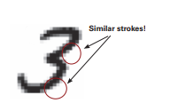
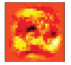
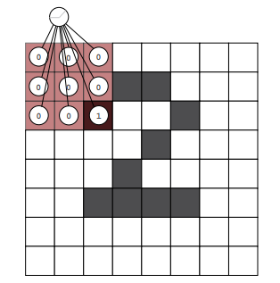
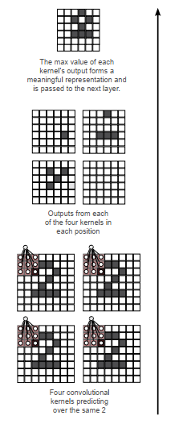

# Lab : 

#### Pre-reqs:
- Google Chrome (Recommended)

#### Lab Environment
Notebooks are ready to run. All packages have been installed. There is no requirement for any setup.

**Note:** Elev8ed Notebooks (powered by Jupyter) will be accessible at the port given to you by your instructor. Password for jupyterLab : `1234`

All Notebooks are present in `work/Grokking-Deep-Learning` folder. To copy and paste: use **Control-C** and to paste inside of a terminal, use **Control-V**

You can access jupyter lab at `<host-ip>:<port>/lab/workspaces/`

<span style="color:red;">Reusing weights in multiple places </span>
If you need to detect the same feature in multiple places,
use the same weights!

The greatest challenge in neural networks is that of
overfitting, when a neural network memorizes a dataset
instead of learning useful abstractions that generalize to
unseen data. In other words, the neural network learns to
predict based on noise in the dataset as opposed to relying on
the fundamental signal (remember the analogy about a fork
embedded in clay?).



Overfitting is often caused by having more parameters than
necessary to learn a specific dataset. In this case, the network has so many parameters that
it can memorize every fine-grained detail in the training dataset (neural network: "Ah. I see
we have image number 363 again. This was the number 2.") instead of learning high-level
abstractions (neural network: "Hmm, it’s got a swooping top, a swirl at the bottom left, and
a tail on the right; it must be a 2."). When neural networks have lots of parameters but not
very many training examples, overfitting is difficult to avoid.

We covered this topic extensively in chapter 8, when we looked at regularization as a means
of countering overfitting. But regularization isn’t the only technique (or even the most ideal
technique) to prevent overfitting.

As I mentioned, overfitting is concerned with the ratio between
the number of weights in the model and the number of
datapoints it has to learn those weights. Thus, there’s a better
method to counter overfitting. When possible, it’s preferable to
use something loosely defined as structure.



Structure is when you selectively choose to reuse weights for
multiple purposes in a neural network because we believe the
same pattern needs to be detected in multiple places. As you’ll see,
this can significantly reduce overfitting and lead to much more
accurate models, because it reduces the weight-to-data ratio.

But whereas normally removing parameters makes the model less expressive (less able
to learn patterns), if you’re clever in where you reuse weights, the model can be equally
expressive but more robust to overfitting. Perhaps surprisingly, this technique also tends
to make the model smaller (because there are fewer actual parameters to store). The most
famous and widely used structure in neural networks is called a convolution, and when used
as a layer it’s called a convolutional layer.


## The convolutional layer
Lots of very small linear layers are reused in every position,
instead of a single big one.

The core idea behind a convolutional layer is that instead of having a large, dense linear
layer with a connection from every input to every output, you instead have lots of very
small linear layers, usually with fewer than 25 inputs and a single output, which you
use in every input position. Each mini-layer is called a convolutional kernel, but it’s
really nothing more than a baby linear layer with a small number of inputs and a
single output.



Shown here is a single 3 × 3 convolutional kernel. It will predict in its current location,
move one pixel to the right, then predict again, move another pixel to the right, and so
on. Once it has scanned all the way across the image, it will move down a single pixel and
scan back to the left, repeating until it has made a prediction in every possible position
within the image. The result will be a smaller square of kernel predictions, which are used
as input to the next layer. Convolutional layers usually have many kernels.


At bottom-right are four different convolutional
kernels processing the same 8 × 8 image of a 2.
Each kernel results in a 6 × 6 prediction matrix.
The result of the convolutional layer with four
3 × 3 kernels is four 6 × 6 prediction matrices.
You can either sum these matrices elementwise
(sum pooling), take the mean elementwise
(mean pooling), or compute the elementwise
maximum value (max pooling).

The max value of each
kernel’s output forms a
meaningful representation and
is passed to the next layer.

The last version turns out to be the most
popular: for each position, look into each of the
four kernel’s outputs, find the max, and copy it
into a final 6 × 6 matrix as pictured at upperright of this page. This final matrix (and only
this matrix) is then forward propagated into the
next layers. 



There are a few things to notice in these
figures. First, the bottom-right kernel forward
propagates a 1 only if it’s focused on a horizontal
line segment. The bottom-left kernel forward
propagates a 1 only if it’s focused on a diagonal
line pointing upward and to the right. Finally,
the bottom-right kernel didn’t identify any
patterns that it was trained to predict.


It’s important to realize that this technique
allows each kernel to learn a particular pattern
and then search for the existence of that pattern
somewhere in the image. A single, small set
of weights can train over a much larger set of
training examples, because even though the
Four convolutional dataset hasn’t changed, each mini-kernel is kernels predicting
forward propagated multiple times on multiple over the same 2 segments of data, thus changing the ratio of weights to datapoints on which those weights are being trained. This has a powerful impact on the network, drastically reducing its ability
to overfit to training data and increasing its ability to generalize.


## A simple implementation in NumPy
Just think mini-linear layers, and you already know what you
need to know.

Let’s start with forward propagation. This method shows how to select a subregion in a batch
of images in NumPy. Note that it selects the same subregion for the entire batch:

```
def get_image_section(layer,row_from, row_to, col_from, col_to):
sub_section = layer[:,row_from:row_to,col_from:col_to]
return subsection.reshape(-1,1,row_to-row_from, col_to-col_from)
```

Now, let’s see how this method is used. Because it selects a subsection of a batch of input
images, you need to call it multiple times (on every location within the image). Such a for
loop looks something like this:

```
layer_0 = images[batch_start:batch_end]
layer_0 = layer_0.reshape(layer_0.shape[0],28,28)
layer_0.shape
sects = list()
for row_start in range(layer_0.shape[1]-kernel_rows):
for col_start in range(layer_0.shape[2] - kernel_cols):
sect = get_image_section(layer_0,
row_start,
row_start+kernel_rows,
col_start,
col_start+kernel_cols)
sects.append(sect)
expanded_input = np.concatenate(sects,axis=1)
es = expanded_input.shape
flattened_input = expanded_input.reshape(es[0]*es[1],-1)
```

In this code, layer_0 is a batch of images 28 × 28 in shape. The for loop iterates through
every (kernel_rows × kernel_cols) subregion in the images and puts them into a list
called sects. This list of sections is then concatenated and reshaped in a peculiar way.

Pretend (for now) that each individual subregion is its own image. Thus, if you had a batch
size of 8 images, and 100 subregions per image, you’d pretend it was a batch size of 800
smaller images. Forward propagating them through a linear layer with one output neuron is
the same as predicting that linear layer over every subregion in every batch (pause and make
sure you get this).

If you instead forward propagate using a linear layer with n output neurons, it will generate the
outputs that are the same as predicting n linear layers (kernels) in every input position of the
image. You do it this way because it makes the code both simpler and faster:

```
kernels = np.random.random((kernel_rows*kernel_cols,num_kernels))
...
kernel_output = flattened_input.dot(kernels)
```


The following listing shows the entire NumPy implementation:
import numpy as np, sys

```
np.random.seed(1)
from keras.datasets import mnist
(x_train, y_train), (x_test, y_test) = mnist.load_data()
images, labels = (x_train[0:1000].reshape(1000,28*28) / 255,
y_train[0:1000])

one_hot_labels = np.zeros((len(labels),10))
for i,l in enumerate(labels):
one_hot_labels[i][l] = 1
labels = one_hot_labels

test_images = x_test.reshape(len(x_test),28*28) / 255
test_labels = np.zeros((len(y_test),10))
for i,l in enumerate(y_test):
test_labels[i][l] = 1

def tanh(x):
return np.tanh(x)

def tanh2deriv(output):
return 1 - (output ** 2)

def softmax(x):
temp = np.exp(x)
return temp / np.sum(temp, axis=1, keepdims=True)

alpha, iterations = (2, 300)
pixels_per_image, num_labels = (784, 10)
batch_size = 128

input_rows = 28
input_cols = 28

kernel_rows = 3
kernel_cols = 3
num_kernels = 16

hidden_size = ((input_rows - kernel_rows) *
(input_cols - kernel_cols)) * num_kernels

kernels = 0.02*np.random.random((kernel_rows*kernel_cols,
num_kernels))-0.01

weights_1_2 = 0.2*np.random.random((hidden_size,
num_labels)) - 0.1

def get_image_section(layer,row_from, row_to, col_from, col_to):
section = layer[:,row_from:row_to,col_from:col_to]
return section.reshape(-1,1,row_to-row_from, col_to-col_from)
```

```
for j in range(iterations):
correct_cnt = 0
for i in range(int(len(images) / batch_size)):
batch_start, batch_end=((i * batch_size),((i+1)*batch_size))
layer_0 = images[batch_start:batch_end]
layer_0 = layer_0.reshape(layer_0.shape[0],28,28)
layer_0.shape

sects = list()
for row_start in range(layer_0.shape[1]-kernel_rows):
for col_start in range(layer_0.shape[2] - kernel_cols):
sect = get_image_section(layer_0,
row_start,
row_start+kernel_rows,
col_start,
col_start+kernel_cols)
sects.append(sect)

expanded_input = np.concatenate(sects,axis=1)
es = expanded_input.shape
flattened_input = expanded_input.reshape(es[0]*es[1],-1)

kernel_output = flattened_input.dot(kernels)
layer_1 = tanh(kernel_output.reshape(es[0],-1))
dropout_mask = np.random.randint(2,size=layer_1.shape)
layer_1 *= dropout_mask * 2
layer_2 = softmax(np.dot(layer_1,weights_1_2))

for k in range(batch_size):
labelset = labels[batch_start+k:batch_start+k+1]
_inc = int(np.argmax(layer_2[k:k+1]) ==
np.argmax(labelset))
correct_cnt += _inc

layer_2_delta = (labels[batch_start:batch_end]-layer_2)\
/ (batch_size * layer_2.shape[0])
layer_1_delta = layer_2_delta.dot(weights_1_2.T) * \
tanh2deriv(layer_1)
layer_1_delta *= dropout_mask
weights_1_2 += alpha * layer_1.T.dot(layer_2_delta)
l1d_reshape = layer_1_delta.reshape(kernel_output.shape)
k_update = flattened_input.T.dot(l1d_reshape)
kernels -= alpha * k_update

test_correct_cnt = 0

for i in range(len(test_images)):

layer_0 = test_images[i:i+1]
layer_0 = layer_0.reshape(layer_0.shape[0],28,28)
layer_0.shape

sects = list()
for row_start in range(layer_0.shape[1]-kernel_rows):
for col_start in range(layer_0.shape[2] - kernel_cols):
sect = get_image_section(layer_0,
row_start,
row_start+kernel_rows,
```

```
col_start,
col_start+kernel_cols)

sects.append(sect)

expanded_input = np.concatenate(sects,axis=1)
es = expanded_input.shape
flattened_input = expanded_input.reshape(es[0]*es[1],-1)

kernel_output = flattened_input.dot(kernels)
layer_1 = tanh(kernel_output.reshape(es[0],-1))
layer_2 = np.dot(layer_1,weights_1_2)

test_correct_cnt += int(np.argmax(layer_2) ==
np.argmax(test_labels[i:i+1]))

if(j % 1 == 0):
sys.stdout.write("\n"+ \
"I:" + str(j) + \
" Test-Acc:"+str(test_correct_cnt/float(len(test_images)))+\
" Train-Acc:" + str(correct_cnt/float(len(images))))
```

```
I:0
I:1
I:2
I:3
I:4
I:5
I:6
I:7
I:8

Test-Acc:0.0288 Train-Acc:0.055
Test-Acc:0.0273 Train-Acc:0.037
Test-Acc:0.028 Train-Acc:0.037
Test-Acc:0.0292 Train-Acc:0.04
Test-Acc:0.0339 Train-Acc:0.046
Test-Acc:0.0478 Train-Acc:0.068
Test-Acc:0.076 Train-Acc:0.083
Test-Acc:0.1316 Train-Acc:0.096
Test-Acc:0.2137 Train-Acc:0.127
....

I:297 Test-Acc:0.8774 Train-Acc:0.816
I:298 Test-Acc:0.8774 Train-Acc:0.804
I:299 Test-Acc:0.8774 Train-Acc:0.814
```

As you can see, swapping out the first layer from the network in chapter 9 with a
convolutional layer gives another few percentage points in error reduction. The output of the
convolutional layer (kernel_output) is itself also a series of two-dimensional images (the
output of each kernel in each input position).

Most uses of convolutional layers stack multiple layers on top of each other, such that each
convolutional layer treats the previous as an input image. (Feel free to do this as a personal
project; it will increase accuracy further.)
Stacked convolutional layers are one of the main developments that allowed for very deep
neural networks (and, by extension, the popularization of the phrase deep learning). It can’t
be overstressed that this invention was a landmark moment for the field; without it, we
might still be in the previous AI winter even at the time of writing.


### Summary
Reusing weights is one of the most important innovations in
deep learning.

Convolutional neural networks are a more general development than you might realize. The
notion of reusing weights to increase accuracy is hugely important and has an intuitive basis.
Consider what you need to understand in order to detect that a cat is in an image. You first
need to understand colors, then lines and edges, corners and small shapes, and eventually
the combination of such lower-level features that correspond to a cat. Presumably, neural
networks also need to learn about these lower-level features (like lines and edges), and the
intelligence for detecting lines and edges is learned in the weights.

But if you use different weights to analyze different parts of an image, each section of
weights has to independently learn what a line is. Why? Well, if one set of weights looking
at one part of an image learns what a line is, there’s no reason to think that another section
of weights would somehow have the ability to use that information: it’s in a different part
of the network.

Convolutions are about taking advantage of a property of learning. Occasionally, you need
to use the same idea or piece of intelligence in multiple places; and if that’s the case, you
should attempt to use the same weights in those locations. This brings us to one of the most
important ideas in this book. If you don’t learn anything else, learn this:

**The structure trick**

When a neural network needs to use the same idea in multiple places, endeavor to use the
same weights in both places. This will make those weights more intelligent by giving them
more samples to learn from, increasing generalization.

Many of the biggest developments in deep learning over the past five years (some before) are
iterations of this idea. Convolutions, recurrent neural networks (RNNs), word embeddings,
and the recently published capsule networks can all be viewed through this lens. When you
know a network will need the same idea in multiple places, force it to use the same weights
in those places. I fully expect that more deep learning discoveries will continue to be based
on this idea, because it’s challenging to discover new, higher-level abstract ideas that neural
networks could use repeatedly throughout their architecture.
