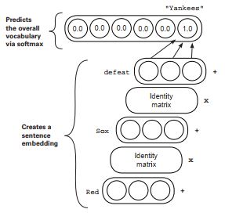
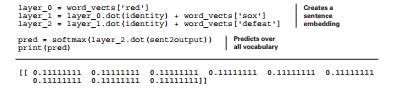

# Lab : Neural networks that write like Shakespeare: recurrent layers for variable-length data

#### Pre-reqs:
- Google Chrome (Recommended)

#### Lab Environment
Notebooks are ready to run. All packages have been installed. There is no requirement for any setup.

**Note:** Elev8ed Notebooks (powered by Jupyter) will be accessible at the port given to you by your instructor. Password for jupyterLab : `1234`

All Notebooks are present in `work/Grokking-Deep-Learning` folder. To copy and paste: use **Control-C** and to paste inside of a terminal, use **Control-V**

You can access jupyter lab at `<host-ip>:<port>/lab/workspaces/lab9_Recurrence`

##### Run Notebook
Click notebook `Chapter12 - Intro to Recurrence - Predicting the Next Word- Practice.ipynb` in jupterLab UI and run jupyter notebook. 
There are some placeholder(s) to write code in the notebook. You can get help from solution notebook `Chapter12 - Intro to Recurrence - Predicting the Next Word.ipynb` as well as lab guide.

<h4><span style="color:red;">The challenge of arbitrary length</span></h4>

**Let’s model arbitrarily long sequences of data with neural networks!**

This lab and chapter 11 are intertwined, and I encourage you to ensure that you’ve
mastered the concepts and techniques from chapter 11 before you dive into this one. In
chapter 11, you learned about natural language processing (NLP). This included how to
modify a loss function to learn a specific pattern of information within the weights of a
neural network. You also developed an intuition for what a word embedding is and how it
can represent shades of similarity with other word embeddings. In this lab, we’ll expand
on this intuition of an embedding conveying the meaning of a single word by creating
embeddings that convey the meaning of variable-length phrases and sentences.

Let’s first consider this challenge. If you wanted to create a vector that held an entire
sequence of symbols within its contents in the same way a word embedding stores
information about a word, how would you accomplish this? We’ll start with the simplest
option. In theory, if you concatenated or stacked the word embeddings, you’d have a vector
of sorts that held an entire sequence of symbols.
the


But this approach leaves something to be desired, because different sentences will have
different-length vectors. This makes comparing two vectors together tricky, because one
vector will stick out the side. Consider the following second sentence:


In theory, these two sentences should be very similar, and comparing their vectors should
indicate a high degree of similarity. But because "the cat sat" is a shorter vector, you have to choose which part of "the cat sat still" vector to compare to. If you align left, the vectors will appear to be identical (ignoring the fact that "the cat sat still" is, in fact, a different sentence). But if you align right, then the vectors will appear to be extraordinarily different, despite the fact that three-quarters of the words are the same, in the same order. Although this naive approach shows some promise, it’s far from ideal in terms of representing the meaning of a sentence in a useful way (a way that can be compared with other vectors).


## Do comparisons really matter?
Why should you care about whether you can compare two
sentence vectors?

The act of comparing two vectors is useful because it gives an approximation of what the
neural network sees. Even though you can’t read two vectors, you can tell when they’re
similar or different (using the function from chapter 11). If the method for generating
sentence vectors doesn’t reflect the similarity you observe between two sentences, then the
network will also have difficulty recognizing when two sentences are similar. All it has to
work with are the vectors!

As we continue to iterate and evaluate various methods for computing sentence vectors,
I want you to remember why we’re doing this. We’re trying to take the perspective of a
neural network. We’re asking, "Will the correlation summarization find correlation between
sentence vectors similar to this one and a desirable label, or will two nearly identical
sentences instead generate wildly different vectors such that there is very little correlation
between sentence vectors and the corresponding labels you’re trying to predict?" We want to
create sentence vectors that are useful for predicting things about the sentence, which, at a
minimum, means similar sentences need to create similar vectors.

The previous way of creating the sentence
vectors (concatenation) had issues because
of the rather arbitrary way of aligning
them, so let’s explore the next-simplest
approach. What if you take the vector
for each word in a sentence, and average
them? Well, right off the bat, you don’t have
to worry about alignment because each
sentence vector is of the same length!


Furthermore, the sentences "the cat sat"
and "the cat sat still" will have similar
sentence vectors because the words going into them are similar. Even better, it’s likely that
"a dog walked" will be similar to "the cat sat," even though no words overlap, because the
words used are also similar.

As it turns out, averaging word embeddings is a surprisingly effective way to create word
embeddings. It’s not perfect (as you’ll see), but it does a strong job of capturing what you
might perceive to be complex relationships between words. Before moving on, I think it will
be extremely beneficial to take the word embeddings from chapter 11 and play around with
the average strategy.


## The surprising power of averaged word vectors
It’s the amazingly powerful go-to tool for neural prediction.

In the previous section, I proposed the second method for creating vectors that convey the
meaning of a sequence of words. This method takes the average of the vectors corresponding
to the words in a sentence, and intuitively we expect these new average sentence vectors to
behave in several desirable ways.

In this section, let’s play with sentence vectors generated using the embeddings from the
previous chapter. Break out the code from chapter 11, train the embeddings on the IMDB
corpus as you did before, and let’s experiment with average sentence embeddings.

At right is the same
normalization performed
when comparing word
embeddings before. But
this time, let’s prenormalize
all the word embeddings
into a matrix called
normed_weights. Then,
create a function called
make_sent_vect and use it
to convert each review (list
of words) into embeddings
using the average approach.
This is stored in the matrix
reviews2vectors.


After this, you create a function that queries for the most similar reviews
given an input review, by performing a dot product between the input review’s
vector and the vector of every other review in the corpus. This dot product similarity metric is the same one we briefly discussed in chapter 4 when you were learning to predict with multiple inputs.

Perhaps surprisingly, when you query for the most similar reviews to the average vector
between the two words "boring" and "awful," you receive back three very negative reviews.
There appears to be interesting statistical information within these vectors, such that
negative and positive embeddings cluster together.


## How is information stored in these embeddings?
When you average word embeddings, average shapes remain.

Considering what’s going on here requires a little abstract thought. I recommend digesting
this kind of information over a period of time, because it’s probably a different kind of lesson than you’re used to. For a moment, I’d like you to consider that a word vector can be visually observed as a squiggly line like this one:


Instead of thinking of a vector as a list of numbers, think about it as a line with high and low points corresponding to high and low values at different places in the vector. If you selected several words from the corpus, they might look like this figure:


Consider the similarities between
the various words. Notice that each
vector’s corresponding shape is
unique. But "terrible" and "boring"
have a certain similarity in their
shape. "beautiful" and "wonderful"
also have a similarity to their shape,
but it’s different from that of the other
words. If we were to cluster these little
squiggles, words with similar meaning would cluster together. More important, parts of
these squiggles have true meaning in and of themselves.

For example, for the negative words, there’s a downward and then upward spike about 40%
from the left. If I were to continue drawing lines corresponding to words, this spike would
continue to be distinctive. There’s nothing magical about that spike that means "negativity,"
and if I retrained the network, it would likely show up somewhere else. The spike indicates
negativity only because all the negative words have it!

Thus, during the course of training, these shapes are molded such that different curves in
different positions convey meaning (as discussed in chapter 11). When you take an average
curve over the words in a sentence, the most dominant meanings of the sentence hold true,
and the noise created by any particular word gets averaged away.


## How does a neural network use embeddings?
Neural networks detect the curves that have correlation
with a target label.

You’ve learned about a new way to view word embeddings as a squiggly line with distinctive
properties (curves). You’ve also learned that these curves are developed throughout the
course of training to accomplish the target objective. Words with similar meaning in
one way or another will often share a distinctive bend in the curve: a combination of
high-low pattern among the weights. In this section, we’ll consider how the correlation
summarization processes these curves as input. What does it mean for a layer to consume
these curves as input?

Truth be told, a neural network consumes embeddings just as it consumed the streetlight
dataset in the book’s early chapters. It looks for correlation between the various bumps and
curves in the hidden layer and the target label it’s trying to predict. This is why words with
one particular aspect of similarity share similar bumps and curves. At some point during
training, a neural network starts developing unique characteristics between the shapes of
different words so it can tell them apart, and grouping them (giving them similar bumps/
curves) to help make accurate predictions. But this is another way of summarizing the
lessons from the end of chapter 11. We want to press further.

In this lab, we’ll consider what it means to sum these embeddings into a sentence
embedding. What kinds of classifications would this summed vector be useful for? We’ve
identified that taking an average across the word embeddings of a sentence results in a
vector with an average of the characteristics of the words therein. If there are many positive
words, the final embedding will look somewhat positive (with other noise from the words
generally cancelling out). But note that this approach is a bit mushy: given enough words,
these different wavy lines should all average together to generally be a straight line.
This brings us to the first weakness of this approach: when attempting to store arbitrarily
long sequences (a sentence) of information into a fixed-length vector, if you try to store too
much, eventually the sentence vector (being an average of a multitude of word vectors) will
average out to a straight line (a vector of near-0s).

In short, this process of storing the information of a sentence doesn’t decay nicely. If you try
to store too many words into a single vector, you end up storing almost nothing. That being
said, a sentence is often not that many words; and if a sentence has repeating patterns, these
sentence vectors can be useful, because the sentence vector will retain the most dominant
patterns present across the word vectors being summed (such as the negative spike in the
previous section).


## The limitations of bag-of-words vectors
Order becomes irrelevant when you average word embeddings.

The biggest issue with average embeddings is that they have no concept of order. For
example, consider the two sentences "Yankees defeat Red Sox" and "Red Sox defeat
Yankees." Generating sentence vectors for these two sentences using the average approach
will yield identical vectors, but the sentences are conveying the exact opposite information!
Furthermore, this approach ignores grammar and syntax, so "Sox Red Yankees defeat" will
also yield an identical sentence embedding.

This approach of summing or averaging word embeddings to form the embedding for a
phrase or sentence is classically known as a bag-of-words approach because, much like
throwing a bunch of words into a bag, order isn’t preserved. The key limitation is that you
can take any sentence, scramble all the words around, and generate a sentence vector, and
no matter how you scramble the words, the vector will be the same (because addition is
associative: a + b == b + a).

The real topic of this lab is generating sentence vectors in a way where order does
matter. We want to create vectors such that scrambling them around changes the resulting
vector. More important, the way in which order matters (otherwise known as the way
in which order changes the vector) should be learned. In this way, the neural network’s
representation of order can be based around trying to solve a task in language and, by
extension, hopefully capture the essence of order in language. I’m using language as an
example here, but you can generalize these statements to any sequence. Language is just a
particularly challenging, yet universally known, domain.

One of the most famous and successful ways of generating vectors for
sequences (such as a sentence) is a recurrent neural network (RNN). In
order to show you how it works, we’ll start by coming up with a new,
and seemingly wasteful, way of doing the average word embeddings
using something called an identity matrix. An identity matrix is just an
arbitrarily large, square matrix (num rows == num columns) of 0s with
1s stretching from the top-left corner to the bottom-right corner as in the
examples shown here.

All three of these matrices are identity matrices, and they have one
purpose: performing vector-matrix multiplication with any vector will
return the original vector. If I multiply the vector [3,5] by the top
identity matrix, the result will be [3,5].


```
[1,0]
[0,1]
[1,0,0]
[0,1,0]
[0,0,1]
[1,0,0,0]
[0,1,0,0]
[0,0,1,0]
[0,0,0,1]
```


## Using identity vectors to sum word embeddings
Let’s implement the same logic using a different approach.
You may think identity matrices are useless. What’s the purpose of a matrix that takes a
vector and outputs that same vector? In this case, we’ll use it as a teaching tool to show how
to set up a more complicated way of summing the word embeddings so the neural network
can take order into account when generating the final sentence embedding. Let’s explore
another way of summing embeddings.


This is the standard technique for summing
multiple word embeddings together to form
a sentence embedding (dividing by the
number of words gives the average sentence
embedding). The example on the right adds
a step between each sum: vector-matrix
multiplication by an identity matrix.


The vector for "Red" is multiplied by an
identity matrix, and then the output is
summed with the vector for "Sox," which is
then vector-matrix multiplied by the identity
matrix and added to the vector for "defeat,"
and so on throughout the sentence. Note that because the vector-matrix multiplication by
the identity matrix returns the same vector that goes into it, the process on the right yields
exactly the same sentence embedding as the process at top left.

Yes, this is wasteful computation, but that’s about to change. The main thing to consider
here is that if the matrices used were any matrix other than the identity matrix, changing the
order of the words would change the resulting embedding. Let’s see this in Python.


## Matrices that change absolutely nothing
Let’s create sentence embeddings using identity matrices in Python.

In this section, we’ll demonstrate how to play with identity matrices in Python and
ultimately implement the new sentence vector technique from the previous section (proving
that it produces identical sentence embeddings).

At right, we first initialize four vectors (a, b, c, and d) of length 3 as well as an identity
matrix with three rows and three columns (identity
matrices are always square). Notice that the identity
matrix has the characteristic set of 1s running
diagonally from top-left to bottom-right (which,
by the way, is called the diagonal in linear algebra).
Any square matrix with 1s along the diagonal and 0s
everywhere else is an identity matrix.

We then proceed to perform vector-matrix
multiplication with each of the vectors and the
identity matrix (using NumPy’s dot function). As
you can see, the output of this process is a new vector
identical to the input vector.
Because vector-matrix multiplication by an
identity matrix returns the same vector we started
with, incorporating this process into the sentence
embedding should seem trivial, and it is:


                                 
```
this = np.array([2,4,6])
movie = np.array([10,10,10])
rocks = np.array([1,1,1])

print(this + movie + rocks)
print((this.dot(identity) + movie).dot(identity) + rocks)
```

Both ways of creating sentence embeddings generate the same
vector. This is only because the identity matrix is a very special
kind of matrix. But what would happen if we didn’t use the
identity matrix? What if, instead, we used a different matrix? In fact, the identity matrix is
the only matrix guaranteed to return the same vector that it’s vector-matrix multiplied with.
No other matrix has this guarantee.

```
[13 15 17]
[ 13. 15.17.]
``` 

## Learning the transition matrices
What if you allowed the identity matrices to change
to minimize the loss?

Before we begin, let’s remember the goal: generating sentence embeddings that cluster
according to the meaning of the sentence, such that given a sentence, we can use the vector
to find sentences with a similar meaning. More specifically, these sentence embeddings
should care about the order of words.

Previously, we tried summing word embeddings. But this meant "Red Sox defeat Yankees"
had an identical vector to the sentence "Yankees defeat Red Sox," despite the fact that these
two sentences have opposite meanings. Instead, we want to form sentence embeddings
where these two sentences generate different embeddings (yet still cluster in a meaningful
way). The theory is that if we use the identity-matrix way of creating sentence embeddings,
but used any other matrix other than the identity matrix, the sentence embeddings would be
different depending on the order.

Now the obvious question: what matrix to use instead of the identity matrix. There are
an infinite number of choices. But in deep learning, the standard answer to this kind
of question is, "You’ll learn the matrix just like you learn any other matrix in a neural
network!" OK, so you’ll just learn this matrix. How?

Whenever you want to train a neural network to learn something, you always need a task
for it to learn. In this case, that task should require it to generate interesting sentence
embeddings by learning both useful word vectors and useful modifications to the identity
matrices. What task should you use?


The goal was similar when you wanted to generate useful word embeddings (fill in the
blank). Let’s try to accomplish a very similar task: training a neural network to take a list of words and attempt to predict the next word.


## Learning to create useful sentence vectors
Create the sentence vector, make a prediction, and modify the
sentence vector via its parts.

In this next experiment, I don’t want you to think about the network like previous neural
networks. Instead, think about creating a sentence embedding, using it to predict the next
word, and then modifying the respective parts that formed the sentence embedding to
make this prediction more accurate. Because you’re predicting the next word, the sentence
embedding will be made from the parts of the sentence you’ve seen so far. The neural network
will look something like the figure.


It’s composed of two steps: create
the sentence embedding, and then
use that embedding to predict which
word comes next. The input to this
network is the text "Red Sox defeat,"
and the word to be predicted is
"Yankees."



I’ve written Identity matrix in the
boxes between the word vectors.
This matrix will only start as an
identity matrix. During training,
you’ll backpropagate gradients into
these matrices and update them
to help the network make better
predictions (just as for the rest of the
weights in the network).


This way, the network will learn how
to incorporate more information than just a sum of word embeddings. By allowing the (initially,
identity) matrices to change (and become not identity matrices), you let the neural network
learn how to create embeddings where the order in which the words are presented changes the
sentence embedding. But this change isn’t arbitrary. The network will learn how to incorporate
the order of words in a way that’s useful for the task of predicting the next word.

You’ll also constrain the transition matrices (the matrices that are originally identity
matrices) to all be the same matrix. In other words, the matrix from "Red" -> "Sox" will
be reused to transition from "Sox" -> "defeat." Whatever logic the network learns in one
transition will be reused in the next, and only logic that’s useful at every predictive step will
be allowed to be learned in the network.


## Forward propagation in Python
Let’s take this idea and see how to perform a simple
forward propagation.

Now that you have the conceptual idea of what you’re trying to build, let’s check out a toy
version in Python. First, let’s set up the weights (I’m using a limited vocab of nine words):

```
import numpy as np

def softmax(x_):
x = np.atleast_2d(x_)
temp = np.exp(x)
return temp / np.sum(temp, axis=1, keepdims=True)
```


This code creates three sets of weights. It creates a Python dictionary of word embeddings,
the identity matrix (transition matrix), and a classification layer. This classification layer
sent2output is a weight matrix to predict the next word given a sentence vector of length 3.
With these tools, forward propagation is trivial. Here’s how forward propagation works with
the sentence "red sox defeat" -> "yankees":




## How do you backpropagate into this?
It might seem trickier, but they’re the same steps you
already learned.

You just saw how to perform forward prediction for this network. At first, it might not be
clear how backpropagation can be performed. But it’s simple. Perhaps this is what you see:


Based on previous chapters, you should feel comfortable with computing a loss and
backpropagating until you get to the gradients at layer_2, called layer_2_delta. At this
point, you might be wondering, "Which direction do I backprop in?" Gradients could go
back to layer_1 by going backward through the identity matrix multiplication, or they
could go into word_vects['defeat'].

When you add two vectors together during forward propagation, you backpropagate the
same gradient into both sides of the addition. When you generate layer_2_delta, you’ll
backpropagate it twice: once across the identity matrix to create layer_1_delta, and again
to word_vects['defeat']:


## Let’s train it!
You have all the tools; let’s train the network on a toy corpus.

So that you can get an intuition for what’s going on, let’s first train the new network on a toy
task called the Babi dataset. This dataset is a synthetically generated question-answer corpus
to teach machines how to answer simple questions about an environment. You aren’t using
it for QA (yet), but the simplicity of the task will help you better see the impact made by
learning the identity matrix. First, download the Babi dataset. Here are the bash commands:

```
wget http://www.thespermwhale.com/jaseweston/babi/tasks_1-20_v1-1.tar.gz
tar -xvf tasks_1-20_v1-1.tar.gz

With some simple Python, you can open and clean a small dataset to train the network:

import sys,random,math
from collections import Counter
import numpy as np

f = open('tasksv11/en/qa1_single-supporting-fact_train.txt','r')
raw = f.readlines()
f.close()

tokens = list()
for line in raw[0:1000]:
tokens.append(line.lower().replace("\n","").split(" ")[1:])

print(tokens[0:3])

[['Mary', 'moved', 'to', 'the', 'bathroom'],
['John', 'went', 'to', 'the', 'hallway'],
['Where', 'is', 'Mary', 'bathroom'],
```

As you can see, this dataset contains a variety of simple statements and questions (with
punctuation removed). Each question is followed by the correct answer. When used in the
context of QA, a neural network reads the statements in order and answers questions (either
correctly or incorrectly) based on information in the recently read statements.

For now, you’ll train the network to attempt to finish each sentence when given one or more
starting words. Along the way, you’ll see the importance of allowing the recurrent matrix
(previously the identity matrix) to learn.


## Setting things up
Before you can create matrices, you need to learn how many
parameters you have.

As with the word embedding neural network, you first need to create a few useful counts,
lists, and utility functions to use during the predict, compare, learn process. These utility
functions and objects are shown here and should look familiar:

```
vocab = set()
for sent in tokens:
for word in sent:
vocab.add(word)

def words2indices(sentence):
idx = list()
for word in sentence:
idx.append(word2index[word])
return idx

vocab = list(vocab)
word2index = {}
for i,word in enumerate(vocab):
word2index[word]=i

def softmax(x):
e_x = np.exp(x - np.max(x))
return e_x / e_x.sum(axis=0)
```

At left, you create a simple list of the vocabulary words as well as a lookup dictionary
allowing you to go back and forth between a word’s text and its index. You’ll use its index in
the vocabulary list to pick which row and column of the embedding and prediction matrices
correspond to which word. At right is a utility function for converting a list of words to a list
of indices, as well as the function for softmax, which you’ll use to predict the next word.

The following code initializes the random seed (to get consistent results) and then sets the
embedding size to 10. You create a matrix of word embeddings, recurrent embeddings, and
an initial start embedding. This is the embedding modeling an empty phrase, which is
key to the network modeling how sentences tend to start. Finally, there’s a decoder weight
matrix (just like from embeddings) and a one_hot utility matrix:


## Forward propagation with arbitrary length
You’ll forward propagate using the same logic described earlier.
The following code contains the logic to forward propagate and predict the next word.
Note that although the construction might feel unfamiliar, it follows the same procedure as
before for summing embeddings while using the identity matrix. Here, the identity matrix is
replaced with a matrix called recurrent, which is initialized to be all 0s (and will be learned
through training).

Furthermore, instead of predicting only at the last word, you make a prediction
(layer['pred']) at every timestep, based on the embedding generated by the previous
words. This is more efficient than doing a new forward propagation from the beginning of
the phrase each time you want to predict a new term.


There’s nothing particularly new about this bit of code relative to what you’ve learned in the
past, but there’s a particular piece I want to make sure you’re familiar with before we move
forward. The list called layers is a new way to forward propagate.

Notice that you end up doing more forward propagations if the length of sent is larger. As
a result, you can’t use static layer variables as before. This time, you need to keep appending
new layers to the list based on the required number. Be sure you’re comfortable with what’s
going on in each part of this list, because if it’s unfamiliar to you in the forward propagation
pass, it will be very difficult to know what’s going on during the backpropagation and weight
update steps.


## Backpropagation with arbitrary length
You’ll backpropagate using the same logic described earlier.

As described with the "Red Sox defeat Yankees" example, let’s implement backpropagation
over arbitrary-length sequences, assuming you have access to the forward propagation
objects returned from the function in the previous section. The most important object is the
layers list, which has two vectors (layer['state'] and layer['previous->hidden']).

In order to backpropagate, you’ll take the output gradient and add a new object to each
list called layer['state_delta'], which will represent the gradient at that layer. This
corresponds to variables like sox_delta, layer_0_delta, and defeat_delta from the "Red
Sox defeat Yankees" example. You’re building the same logic in a way that it can consume
the variable-length sequences from the forward propagation logic.


Before moving on to the next section, be sure you can read this code and explain it to a
friend (or at least to yourself). There are no new concepts in this code, but its construction
can make it seem a bit foreign at first. Spend some time linking what’s written in this code
back to each line of the "Red Sox defeat Yankees" example, and you should be ready for the
next section and updating the weights using the gradients you backpropagated.


## Weight update with arbitrary length
You’ll update weights using the same logic described earlier.

As with the forward and backprop logic, this weight update logic isn’t new. But I’m
presenting it after having explained it so you can focus on the engineering complexity,
having (hopefully) already grokked (ha!) the theory complexity.


## Execution and output analysis
You’ll update weights using the same logic described earlier.

Now the moment of truth: what happens when you run it? Well, when I run this code, I
get a relatively steady downtrend in a metric called perplexity. Technically, perplexity is
the probability of the correct label (word), passed through a log function, negated, and
exponentiated (e^x).

But what it represents theoretically is the difference between two probability distributions.
In this case, the perfect probability distribution would be 100% probability allocated to the
correct term and 0% everywhere else.

Perplexity is high when two probability distributions don’t match, and it’s low (approaching
1) when they do match. Thus, a decreasing perplexity, like all loss functions used with
stochastic gradient descent, is a good thing! It means the network is learning to predict
probabilities that match the data.

```
Perplexity:82.09227500075585
Perplexity:81.87615610433569
Perplexity:81.53705034457951
....
Perplexity:4.132556753967558
Perplexity:4.071667181580819
Perplexity:4.0167814473718435
```

But this hardly tells you what’s going on in the weights. Perplexity has faced some criticism
over the years (particularly in the language-modeling community) for being overused as a
metric. Let’s look a little more closely at the predictions:

```
sent_index = 4

l,_ = predict(words2indices(tokens[sent_index]))

print(tokens[sent_index])

for i,each_layer in enumerate(l[1:-1]):
input = tokens[sent_index][i]
true = tokens[sent_index][i+1]
pred = vocab[each_layer['pred'].argmax()]
print("Prev Input:" + input + (' ' * (12 - len(input))) +\
"True:" + true + (" " * (15 - len(true))) + "Pred:" + pred)
``` 

This code takes a sentence and predicts the word the model thinks is most likely. This is
useful because it gives a sense for the kinds of characteristics the model takes on. What
kinds of things does it get right? What kinds of mistakes does it make? You’ll see in the
next section.


## Looking at predictions can help you understand what’s going on.
You can look at the output predictions of the neural network as it trains to learn not only
what kinds of patterns it picks up, but also the order in which it learns them. After 100
training steps, the output looks like this:

```
['sandra', 'moved', 'to', 'the', 'garden.']
Prev Input:sandra
True:moved
Pred:is
Prev Input:moved
True:to
Pred:kitchen
Prev Input:to
True:the
Pred:bedroom
Prev Input:the
True:garden.
Pred:office
```

Neural networks tend to start off random. In this case, the neural network is likely only
biased toward whatever words it started with in its first random state. Let’s keep training:

```
['sandra', 'moved', 'to', 'the', 'garden.']
Prev Input:sandra
True:moved
Pred:the
Prev Input:moved
True:to
Pred:the
Prev Input:to
True:the
Pred:the
Prev Input:the
True:garden.
Pred:the
```

After 10,000 training steps, the neural network picks out the most common word ("the") and
predicts it at every timestep. This is an extremely common error in recurrent neural networks.
It takes lots of training to learn finer-grained detail in a highly skewed dataset.

```
['sandra', 'moved', 'to', 'the', 'garden.']
Prev Input:sandra
True:moved
Pred:is
Prev Input:moved
True:to
Pred:to
Prev Input:to
True:the
Pred:the
Prev Input:the
True:garden.
Pred:bedroom.
```

These mistakes are really interesting. After seeing only the word "sandra," the network
predicts "is," which, although not exactly the same as "moved," isn’t a bad guess. It picked the
wrong verb. Next, notice that the words "to" and "the" were correct, which isn’t as surprising
because these are some of the more common words in the dataset, and presumably the
network has been trained to predict the phrase "to the" after the verb "moved" many times.
The final mistake is also compelling, mistaking "bedroom" for the word "garden."

It’s important to note that there’s almost no way this neural network could learn this task
perfectly. After all, if I gave you the words "sandra moved to the," could you tell me the
correct next word? More context is needed to solve this task, but the fact that it’s unsolvable,
in my opinion, creates educational analysis for the ways in which it fails.


### Summary
Recurrent neural networks predict over arbitrary-length
sequences.

In this lab, you learned how to create vector representations for arbitrary-length
sequences. The last exercise trained a linear recurrent neural network to predict the
next term given a previous phrase of terms. To do this, it needed to learn how to create
embeddings that accurately represented variable-length strings of terms into a fixed-size
vector.

This last sentence should drive home a question: how does a neural network fit a variable
amount of information into a fixed-size box? The truth is, sentence vectors don’t encode
everything in the sentence. The name of the game in recurrent neural networks is not just
what these vectors remember, but also what they forget. In the case of predicting the next
word, most RNNs learn that only the last couple of words are really necessary,* and they
learn to forget (aka, not make unique patterns in their vectors for) words further back in
the history.

But note that there are no nonlinearities in the generation of these representations. What
kinds of limitations do you think that could create? In the next lab, we’ll explore this
question and more using nonlinearities and gates to form a neural network called a long
short-term memory network (LSTM). But first, make sure you can sit down and (from
memory) code a working linear RNN that converges. The dynamics and control flow of
these networks can be a bit daunting, and the complexity is about to jump by quite a bit.
Before moving on, become comfortable with what you’ve learned in this lab.
And with that, let’s dive into LSTMs!
